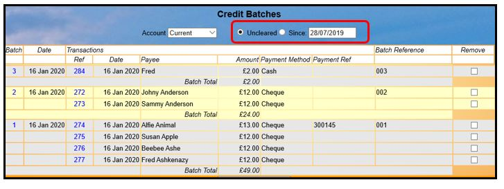
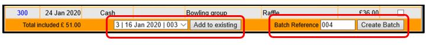
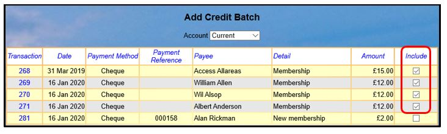
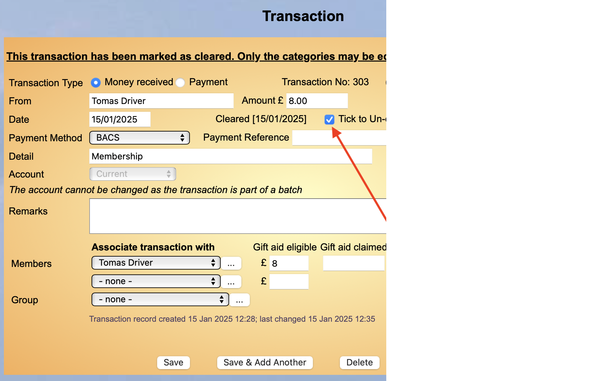
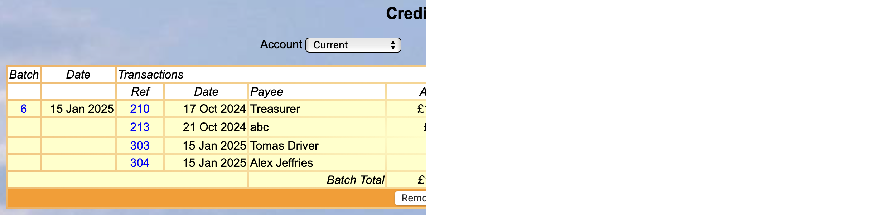
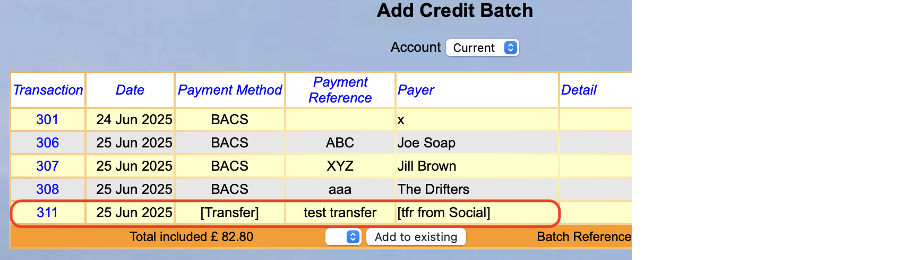

**7.4** **Credit** **Batches**

> Back

When several cheques and cash are paid into a bank at the same time, it
is usual for a bank statement to record only the total amount, not each
individual cheque. This can make it difficult to reconcile the statement
against individual transactions.

**Credit** **Batches** are a facility to make reconciliation simpler.
All cheques and cash paid in at one time are assigned to a Credit Batch
and the batch appears in the Reconciliation listing. When the bank
statement entry is reconciled against the Credit Batch, the component
Transactions are reconciled automatically.

Viewing Credit Batches

Select **Credit** **batches** from the Home Page and choose either
**Uncleared** to see all uncleared Batches, or enter a date to see all
Batches since that date.

Creating & adding to Credit Batches

Click **Add** **batch** from the Ledger or **Add** **credit** **batch**
from the Credit Batches page to display a list of outstanding payments
for the selected Account. The display can be sorted on any of the
columns by clicking the blue column headings. Tick the ones to be added
to a Batch.

You also include Transfers into a batch to aid reconciliation.

To add to an existing
uncleared batch, selected the batch from the drop-down list at the
bottom of the page and press **Add** **to** **Existing**.

To create a new batch, enter a **Batch** **Reference** and press
**Create** **Batch**

Removing individual transaction from a Credit Batch

To remove a transaction from an existing batch, it the batch has been
reconciled then you will first need to open the individual Transaction.

As you can see above the arrow shows where to tick and then you Save
this transaction.

If you then go to the Credit Batch and select Cleared ones you will see
a part cleared batch.

In the batch you now select on the right the individual transaction to
remove from the batch and presss the Remove Transactions button at the
bottom.

Adding Transfers to a Credit Batch

In summary the process is the same as for a payment.

In the image above we highlight a Transfer to be included in the Credit
Batch. The effect is the same as for any other Credit.

It should be noted that Transfers once they have been included in
Reconciliation (Cleared) do not have a process to remove from being
cleared.

You can still Delete or Edit a Cleared Transfer.

Revision History

||
||
||
||
