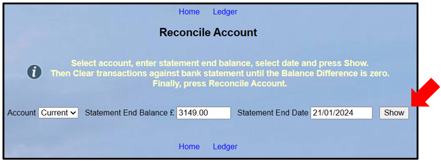
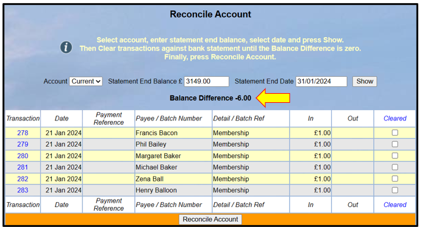
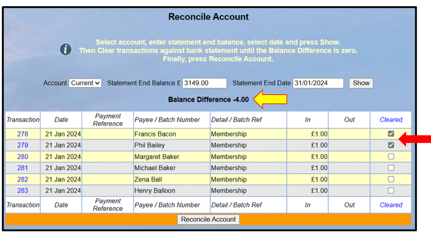
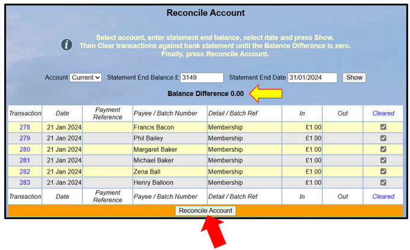
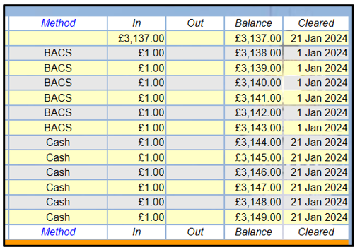
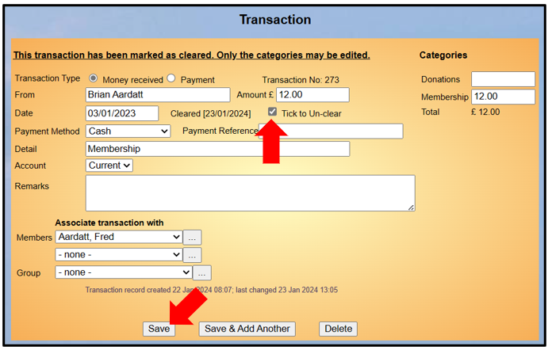

**7.5** **Reconcile** **Account**

> Back

**For** **experienced** **treasurers** **there** **is** **an**
**alternative** **method** **at** **the** **bottom** **of** **this**
**article.**

Reconciliation is the process of ensuring that Beacon's Ledger and your
bank statements are synchronised, enabling any discrepancies to be
identified. See [<u>7.10 Financial
Approaches</u>](https://u3abeacon.zendesk.com/hc/en-gb/articles/360007368058-7-10-Financial-Approaches)
for a recommended alternative way of working to reconciling bank
accounts.

Select **Reconcile** **account** from the Home Page or the Ledger.
Select the **Account** to be reconciled, enter the bank **Statement**
**End** **Balance** and select the **Statement** **End** **Date**.

Press the **Show** button.

A list of all uncleared (unreconciled) transactions for the account will
be shown together with the **Balance** **Difference** between Beacon and
the bank statement at the top of the list. The Balance Difference starts
as the balance at the last reconciliation (or balance brought forward)
minus the amount entered from the bank statement.

A positive **Balance** **Difference** means there are an excess of funds
(credit transactions, i.e. deposits) in the ledger still to be cleared.
Conversely, when negative then debit transactions (withdrawals) in the
ledger need to be cleared.

The aim of reconciliation is to reduce the balance difference to zero
and to ensure that any difference is understood (e.g. caused by timing
differences).

Go through the bank statement in order and identify matching entries in
the reconciliation list. Tick the **Cleared** checkbox for each entry
that agrees until the Balance Difference is reduced to zero.

Transactions can be checked or unchecked as a batch by clicking
**Cleared** at the top or bottom of the right hand column, followed by
**Select** **All** or **Clear** **All**:

When the Balance Difference has been reduced to zero, press
**Reconcile** **Account** at the bottom of the list:

After Transactions have been reconciled, the **Cleared** **date** is
displayed in the Ledger and on the Transaction Record.

It is still possible to edit the **Categories** of cleared Transactions
in the current or previous financial year. Transactions prior to the
previous financial year may not be edited.

It is also possible to Un-clear a transaction that belongs to the
current or previous financial year by checking **Tick** **to**
**Un-clear** and **Saving** the Transaction.

**An** **Alternative** **approach** **to** **the** **process**

The experienced treasurer will often find that the account reconciles.
In this case a different and alternative approach is to bring up the
Reconciliation screen and on top right select Cleared, and from the
options select All.

If your account then shows a balance difference of £ Zero then all is
reconciled so you just save this screen and move to your next task.

If the balance is not £ zero then you need to identify the reason. It is
likely that you can still reconcile some transactions, Save the
Reconciliation and then investigate the other transactions.

Revision History

||
||
||
||
||
||
