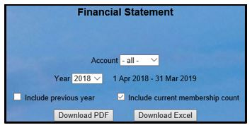
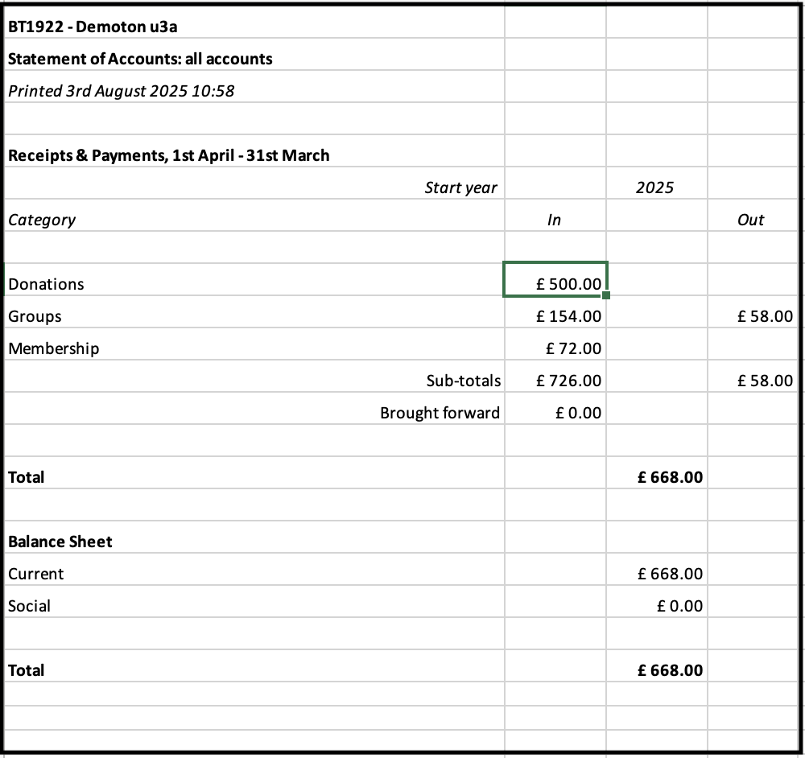
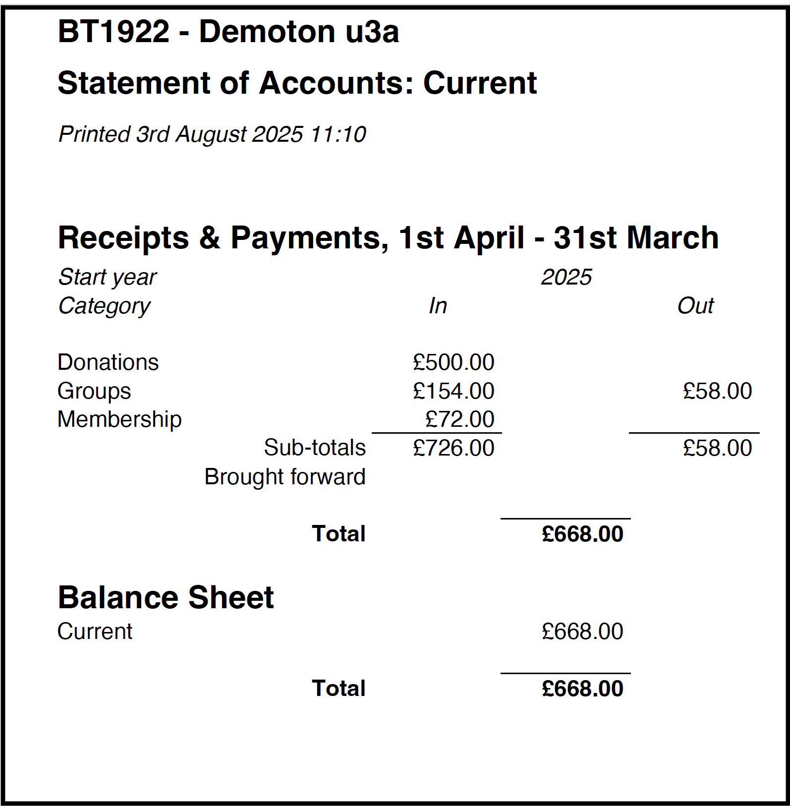
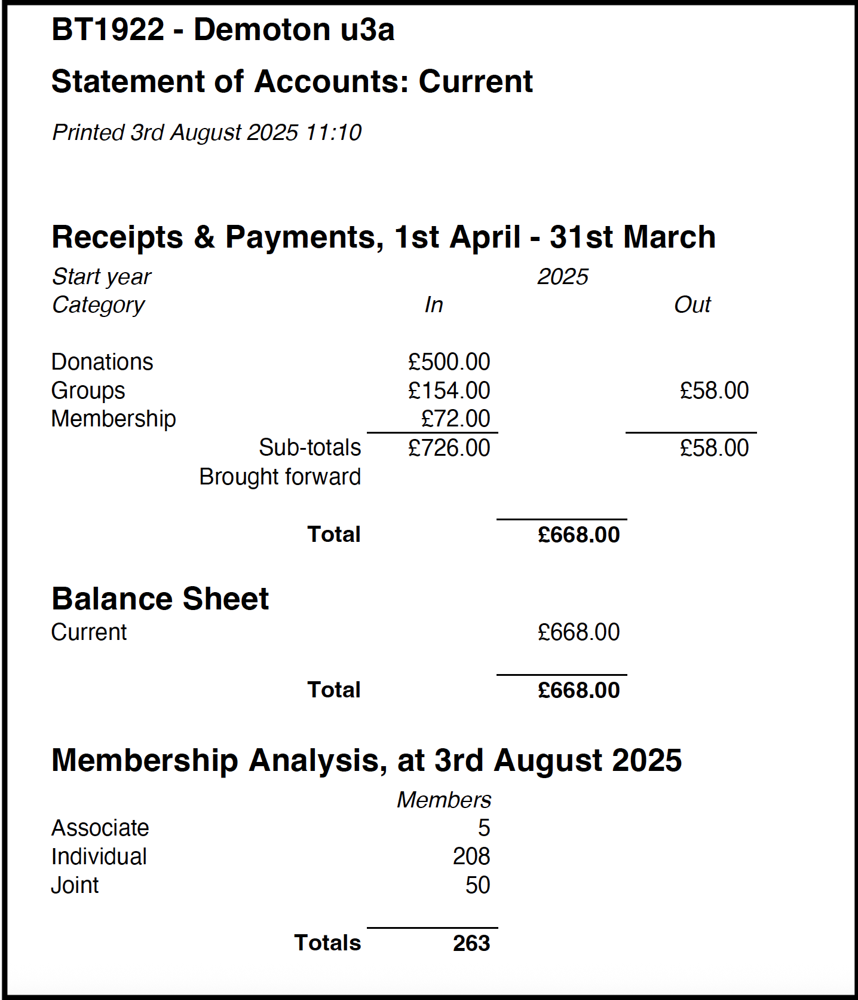
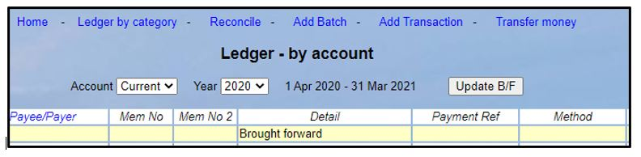

**7.6** **Financial** **Statement**

> Back

To run an Receipts and Payments report and Balance Sheet, click
**Financial** **statement** on the Home Page.

You may report on any account, or ‘all combined’ by selecting from the
**Account** drop-down list.

>  style="width:3.72917in;height:1.92708in" />Select the **Financial**
> **Year** (see the end of this article), tick if you want the
> **previous** **year**'s statement to be included and tick if you want
> a <u>current</u> membership count should be included in the report.

Press **Download** **PDF** or **Download** **Excel**

You can now view or save to file from your downloads folder.

**Typical** **Excel** **Download** **for** **all** **Accounts**

**PDF** **Download:** **Current** **Account**

If you select other accounts you can run off a Statement of Account for
each individual account.

**PDF** **Download:** **Current** **Account** **with** **Membership**
**Analysis**

Financial Years

Each u3a will define when their Financial Year starts when their Beacon
Site is first created. The date must be the first day of a month and in
general, should not be subsequently changed (see [**<u>7.10.1 Changing
your Financial
Year</u>**](https://u3abeacon.zendesk.com/hc/en-gb/articles/360019616158))

Each Financial Year is named by the calendar year at the start of the
Financial Year. For example, if a u3a starts its Financial Year on 1st
April, then the Financial year which runs from 1 April 2020 to 31 March
2021 is known as **2020.**

Data for the current year and the last year is editable in Beacon, but
all earlier years should be considered closed and no Transactions for
such dates should be added, changed, or deleted.

Users can view and download data for earlier years for historical
records.

**Revision** **History**

||
||
||
||
||
||
