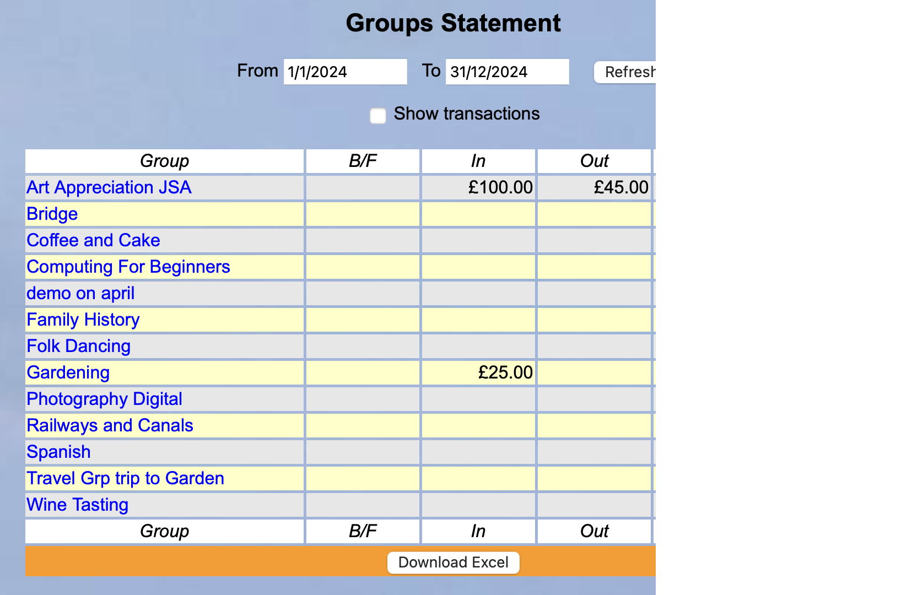
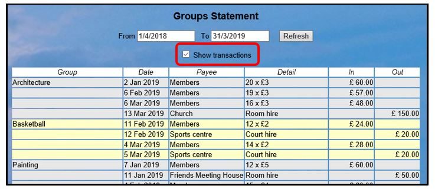
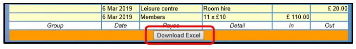
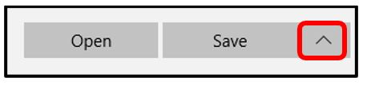
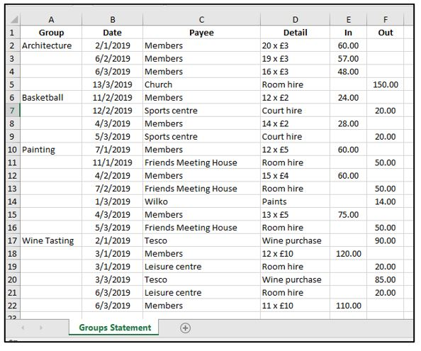

**7.7** **Groups**
**Statement**

> Back

Click **Groups** **statement** on the Home Page to show a summary of
every Group's accounts between the dates selected at the top (as held in
the Group Ledgers, [<u>see
5.5</u>](https://u3abeacon.zendesk.com/hc/en-gb/articles/360007367898)):

The **Status** column on the right shows if Groups are Active (Current)
or Inactive.

*Note:* *These* *figures* *do* *not* *link* *to* *any* *in* *the* *Main*
*Current* *Account* *Ledger* *as* *normally* *controlled* *by* *the*
*Treasurer.*

To show all individual transactions between the selected dates, tick
**Show** **transactions**.

**Excel** **Download**

To download the Groups Statement, press the **Download** **Excel**
button at the bottom of the page.

The statement will be downloaded in the format displayed onscreen (with
or without Transactions).

You will be given the choice of **Opening** the file onscreen or
**Saving** the file in your default download location. Clicking the
arrow next to **Save** gives the option of doing a **Save-as** to a
specified location.

**Revision** **History**

||
||
||
||
||
