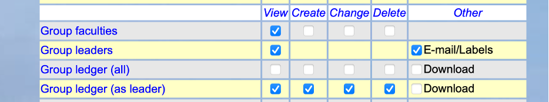
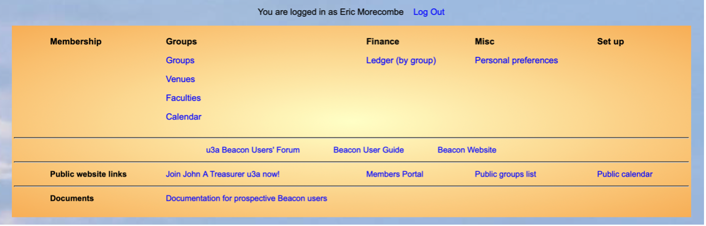
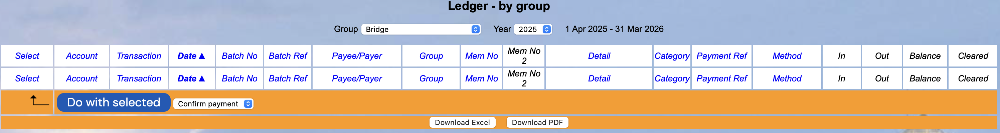
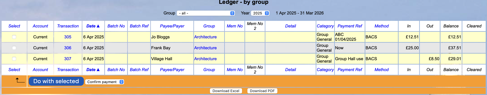

[u3a Beacon](https://u3abeacon.zendesk.com/hc/en-gb) \> [User
Guide](https://u3abeacon.zendesk.com/hc/en-gb/categories/360001240017-User-Guide)
\> [7.
Finance](https://u3abeacon.zendesk.com/hc/en-gb/sections/360002102798-7-Finance)
Search

**Articles** **in** **this** **section**

**7.7.1** **Group** **Leaders** **Viewing** **of** **transactions**
**in** **the** **Main** **Finance** **Ledger**

>  style="width:0.41667in;height:0.41667in" />John Alexander Follow 10
> months ago · Updated

There are a number of things that need to be done to allow this:

> 1\. The Treasurer must be entering transactions associated with the
> group(s).
>
> 2\. The Group Leader will see transactions as the financial year
> progresses. The system will create and display Group brought forward
> balances at the start of the financial year as this will bring into
> the current financial year any balances for each group of allocated
> money.
>
> 3\. The Group Leader needs to be given the rights. This means all
> boxes as shown for Group ledger:

As a Group Leader, if your site does not have this feature set up then
you will need to discuss this with your Treasurer and Committee.

Fig 1

Note this will give only the Viewing rights to all Group Leaders but
only those will transactions associated with their group will be able to
see any transaction.

The Group Leader cannot input or edit any transactions into the main
ledgers. They can only be entered or edited by someone with Treasurer's
privileges.

If this is set up and
transactions are in the ledger when a Group Leader logs into Beacon they
they see the following new item under Finance:

The new view is under Ledger (by group).

Selecting this option only
shows transactions if there are any in the ledger for the groups of
which they are leader. This will see this:

This shows opening balance and transactions with a running balance.

If the Treasurer has set transactions to be marked as Pending, then as
in this illustration the transactions will be shown but marked Pending
and this figures will not be included in the Balance.

Only the treasurer can change the Pending status of these transactions.

If there are no transactions associated with the group of which they are
leader then they will see this screen:

Revision History

||
||
||
||
||

> Was this article helpful?
>
> Yes No
>
> 5 out of 5 found this helpful
>
> Have more questions? [<u>Submit a
> request</u>](https://u3abeacon.zendesk.com/hc/en-gb/requests/new)

Return to top

**Recently** **viewed** **articles** [7.7 Groups
Statement](https://u3abeacon.zendesk.com/hc/en-gb/articles/360007304377-7-7-Groups-Statement)

[7.6.1 Calculate a true
surplus/deficit](https://u3abeacon.zendesk.com/hc/en-gb/articles/360019466057-7-6-1-Calculate-a-true-surplus-deficit)

[7.6 Financial
Statement](https://u3abeacon.zendesk.com/hc/en-gb/articles/360007304357-7-6-Financial-Statement)

[7.5 Reconcile
Account](https://u3abeacon.zendesk.com/hc/en-gb/articles/360007304277-7-5-Reconcile-Account)

[7.4 Credit
Batches](https://u3abeacon.zendesk.com/hc/en-gb/articles/360007367998-7-4-Credit-Batches)

**Related** **articles**

[5.5 Group Record:
Ledger](https://u3abeacon.zendesk.com/hc/en-gb/related/click?data=BAh7CjobZGVzdGluYXRpb25fYXJ0aWNsZV9pZGwrCNp8HNJTADoYcmVmZXJyZXJfYXJ0aWNsZV9pZGwrCJ0RpfQ%2FFDoLbG9jYWxlSSIKZW4tZ2IGOgZFVDoIdXJsSSI8L2hjL2VuLWdiL2FydGljbGVzLzM2MDAwNzM2Nzg5OC01LTUtR3JvdXAtUmVjb3JkLUxlZGdlcgY7CFQ6CXJhbmtpBg%3D%3D--ff49c1a7eb8397974c4f6654c8c7ed70e8749697)

[7.7 Groups
Statement](https://u3abeacon.zendesk.com/hc/en-gb/related/click?data=BAh7CjobZGVzdGluYXRpb25fYXJ0aWNsZV9pZGwrCLmEG9JTADoYcmVmZXJyZXJfYXJ0aWNsZV9pZGwrCJ0RpfQ%2FFDoLbG9jYWxlSSIKZW4tZ2IGOgZFVDoIdXJsSSI5L2hjL2VuLWdiL2FydGljbGVzLzM2MDAwNzMwNDM3Ny03LTctR3JvdXBzLVN0YXRlbWVudAY7CFQ6CXJhbmtpBw%3D%3D--f2d0f0e1c3b4b5bb1deebf9db128bae340ac4c1a)

[7.10 Financial
Approaches](https://u3abeacon.zendesk.com/hc/en-gb/related/click?data=BAh7CjobZGVzdGluYXRpb25fYXJ0aWNsZV9pZGwrCHp9HNJTADoYcmVmZXJyZXJfYXJ0aWNsZV9pZGwrCJ0RpfQ%2FFDoLbG9jYWxlSSIKZW4tZ2IGOgZFVDoIdXJsSSI%2BL2hjL2VuLWdiL2FydGljbGVzLzM2MDAwNzM2ODA1OC03LTEwLUZpbmFuY2lhbC1BcHByb2FjaGVzBjsIVDoJcmFua2kI--8e786e3ebd3d7a885abd9aad3d4a0b10e1058c78)

[10.2 Members
Portal](https://u3abeacon.zendesk.com/hc/en-gb/related/click?data=BAh7CjobZGVzdGluYXRpb25fYXJ0aWNsZV9pZGwrCMp9HNJTADoYcmVmZXJyZXJfYXJ0aWNsZV9pZGwrCJ0RpfQ%2FFDoLbG9jYWxlSSIKZW4tZ2IGOgZFVDoIdXJsSSI4L2hjL2VuLWdiL2FydGljbGVzLzM2MDAwNzM2ODEzOC0xMC0yLU1lbWJlcnMtUG9ydGFsBjsIVDoJcmFua2kJ--84bf19d5abd1968675c371c9e4405b7c8e6f993e)

[7.6.1 Calculate a true
surplus/deficit](https://u3abeacon.zendesk.com/hc/en-gb/related/click?data=BAh7CjobZGVzdGluYXRpb25fYXJ0aWNsZV9pZGwrCEkX1dJTADoYcmVmZXJyZXJfYXJ0aWNsZV9pZGwrCJ0RpfQ%2FFDoLbG9jYWxlSSIKZW4tZ2IGOgZFVDoIdXJsSSJLL2hjL2VuLWdiL2FydGljbGVzLzM2MDAxOTQ2NjA1Ny03LTYtMS1DYWxjdWxhdGUtYS10cnVlLXN1cnBsdXMtZGVmaWNpdAY7CFQ6CXJhbmtpCg%3D%3D--2ca5b15daf5bfb09c61fd370a6417aec515a69bb)

**Comments** 0 comments

Please [<u>sign
in</u>](https://u3abeacon.zendesk.com/access?locale=en-gb&brand_id=360000694158&return_to=https%3A%2F%2Fu3abeacon.zendesk.com%2Fhc%2Fen-gb%2Farticles%2F22264919953821-7-7-1-Group-Leaders-Viewing-of-transactions-in-the-Main-Finance-Ledger)
to leave a comment.

[u3a Beacon](https://u3abeacon.zendesk.com/hc/en-gb)

> [<u>Powered by
> Zendesk</u>](https://www.zendesk.co.uk/service/help-center/?utm_source=helpcenter&utm_medium=poweredbyzendesk&utm_campaign=text&utm_content=u3a+Beacon+Support)
