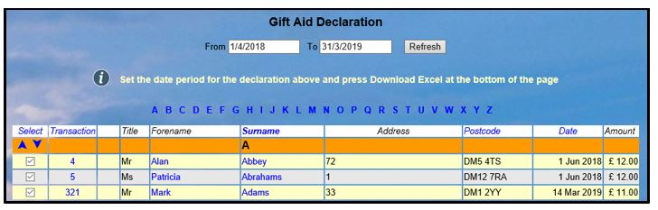
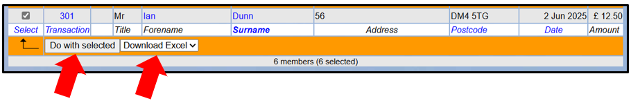
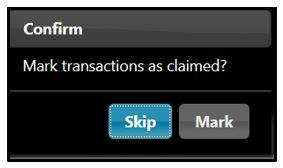
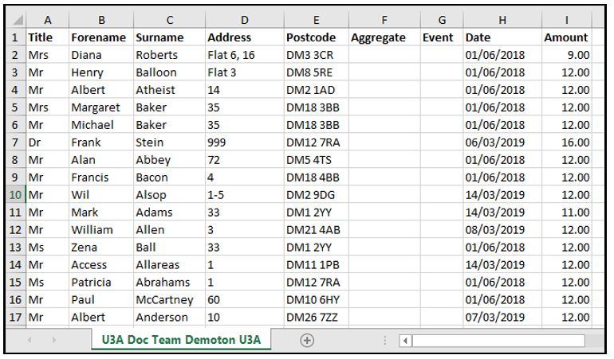
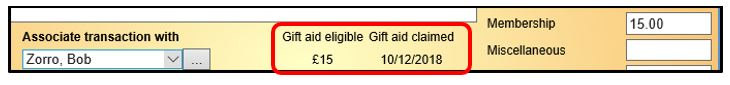
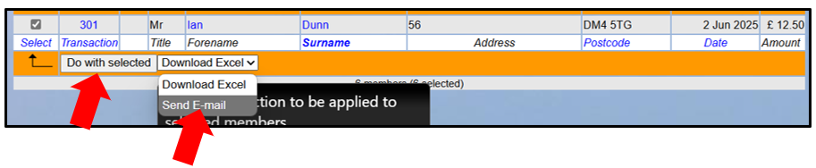
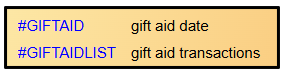

**7.8** **Gift** **Aid**

> Back

**This** **article** **contains** **guidance** **of** **a** **new**
**facility** **NOT** **YET** **IMPLEMENTED.** **This** **allows**
**you** **to** **split** **Membership** **payments** **into** **the**
**part** **on** **which** **you** **can** **claim** **Gift** **Aid**
**and** **the** **part** **on** **which** **you** **cannot** **claim**
**Gift** **Aid**

The implementation has been held up under instruction from the Third Age
Trust.

As a charity, a u3a is eligible to claim ***Gift*** ***Aid*** relief on
membership subscriptions and donations, but only under tightly
prescribed circumstances laid down by HMRC. Before enabling Gift Aid
your u3a must read the advice from the Third Age Trust
[<u>u3a.or</u>g<u>.uk</u>](https://u3a.org.uk/) and HMRC to ensure that
you are eligible to make Gift Aid claims.

Beacon's approach is to determine the income that could be put forward
for Gift Aid relief according to the rules of HMRC, *on* *the*
*assumption* *that* *the* *user's* *u3a* *is* *eligible* *to* *make*
*such* *claims* *in* *the* *first* *place*.

<u>Responsibility for deciding whether or not Gift Aid claims should be
made rests entirely with the u3a</u>.

Gift Aid Set Up

Under System Settings ([<u>see
8.3</u>](https://u3abeacon.zendesk.com/hc/en-gb/articles/360007304457-8-3-System-Settings))
there is a checkbox labelled **Tick** **to** **enable** **Gift** **Aid**
**operation**. Each u3a must decide whether or not to tick this checkbox
and be responsible for the consequences of doing so. If the checkbox is
ticked, Beacon will determine the income that can be submitted to HMRC
for Gift Aid relief.

If the checkbox is not ticked, all Gift Aid functionality will be turned
off (although Member Records will still record whether a member is
eligible for Gift Aid claims).

Gift Aid Qualifying Transactions

Beacon follows strictly the HMRC rules in deciding how much of a
membership subscription or donation may be declared for Gift Aid relief.

Ordinarily, Gift Aid relief may be claimed from that part of a
membership payment that relates to the payer alone and only if the payer
meets the rules for paying tax as indicated by the Gift Aid date field
in the Member Record.

However, if a member and his/her partner both belong to a Membership
Class with the Joint or Family attribute set ([<u>see
4.2</u>](https://u3abeacon.zendesk.com/hc/en-gb/articles/360007303097-4-2-Member-Record)),
then relief may be claimed on the full joint membership payment if the
payer alone meets the rules for paying tax.

Thus, to maximise their Gift Aid relief u3a's should consider having
Joint or Family membership classes in addition to those for individuals.
When setting up a membership class this is indicated by ticking "**1**
**of** **2** **people** **at** **same** **address**". The membership fee
corresponding to a non-taxpaying partner cannot otherwise be declared
for Gift Aid relief.

Some u3a's have a fee structure where the total Membership fee does not
qualify for Gift Aid. An enhancement made to Beacon in June 2025
introduced a second field on the Membership Class page to show the
amount that qualifies for Gift Aid. This can be the same or less (but
not more) than the total Membership fee ([<u>see
8.7</u>)](https://u3abeacon.zendesk.com/hc/en-gb/articles/360007304497).

*Note:* *Additional* *information* *about* *how* *Beacon* *handles*
*members* *with* *partners* *and* *joint* *membership* *is* *available*
*in* [*<u>4.3.2 Shared
Addresses</u>*](https://u3abeacon.zendesk.com/hc/en-gb/articles/360019697318)
[*<u>& Joint
Members</u>*](https://u3abeacon.zendesk.com/hc/en-gb/articles/360019697318)

Gift Aid is not Retrospective

Gift Aid declarations are generated from the Ledger entry created when a
member is added or renews.

If a new member is added and the Gift Aid box ticked then the fee is
recorded as a Gift Aid amount in the ledger. If a member renews then
Gift Aid is recorded if the date is set, even if the date is in the
future. After the ledger is reconciled Gift Aid for a ledger entry
cannot be changed.

Beacon cannot deal with retrospective Gift Aid declarations. The Gift
Aid date acts like a flag to say the member has consented. The date
range of the Gift Aid declaration simply selects ledger entries in that
date range.

If a ledger entry linked to a member payment was created before a Gift
Aid date was entered in the Member Record it will *not* include any Gift
Aid amount. It is possible to change this in Ledger entries manually
providing the Treasurer hasn't locked them by reconciling transactions.

When a u3a first starts using Beacon they should claim Gift Aid up to
the date of their migration using their pre-Beacon process.

Downloading a Gift Aid Declaration

Select **Gift** **Aid** **declaration** on the Home Page. This option is
present only if Gift Aid operation is enabled.

By default, the current financial year is shown and payments for which a
declaration has previously been made are excluded.

To download a declaration spreadsheet, select the payments to be
included by ticking in the **Select** column, select **Download**
**Excel** from the drop-down list below the table and press **Do**
**with** **selected**.

>  style="width:2.56369in;height:1.52191in" />You will be asked to:
>
> **Mark** **transactions** **as** **claimed?** (or **Skip**).
>
> If you press **Mark**, a Claimed date will be added to each
> **Transaction** (see below) and they will not appear again in a
> subsequent Gift Aid declaration.
>
> *Therefore* *‘Mark’* *should* *only* *be* *selected* *when* *you*
> *are* *intending* *to* *use* *the* *download* *to* *make* *a* *Gift*
> *Aid* *claim.* *It* *is* *recommended* *to* *'Skip'* *first* *time*
> *and* *check* *the* *declaration.*

You will be given the choice of **Opening** the file on-screen or
**Saving** the file in your default download location. Clicking the
arrow next to **Save** gives the option of doing a **Save-as** to a
specified location.

Example Excel Gift Aid Download

Example Transaction with Gift Aid claim marked

***Notes:***

*HMRC* *insists* *that* *each* *individual* *record* *has* *a* *Title;*
*e.g.* *Mr,* *Ms,* *Mrs.* *If* *these* *are* *in* *their* *Membership*
*Record* *they* *are* *included* *in* *the* *download* *automatically.*

*Although* *the* *spreadsheet* *format* *is* *correct* *for*
*submission* *to* *HMRC,* *it* *is* *without* *the* *required* *header*
*rows* *and* *not* *in* *OpenDocument* *format* *with* *extension*
*".ods".* *Therefore* *the* *contents* *must* *be* *copied* *and*
*pasted* *into* *the* *official* *submission* *spreadsheet.*

*Make* *sure* *to* *download* *the* *correct* *submission* *spreadsheet*
*for* *either* *Excel* *or* *LibreOffice.* *Also* *note* *that* *the*
*Language* *setting* *must* *be* *UK* *English* *(it* *could* *be* *US*
*English).* *Do* *a* *search* *for* *"HMRC* *guidance* *gift* *aid*
*spreadsheet"* *and* *read* *carefully.*

*The* *Date* *column* *of* *the* *HMRC* *spreadsheet* *says* *it*
*should* *be* *in* *DD/MM/YY* *format.* *Experience* *suggests* *this*
*is* *incorrect* *and* *a* *4* *digit* *year* *is* *required.* *Just*
*copy* *and* *paste* *from* *the* *Beacon* *download* *and* *the*
*dates* *in* *DD/MM/YYYY* *format* *have* *always* *been* *accepted*
*on* *submission.* *Your* *must* *save* *in* ***ods*** ***format***
*(opendocumentspreadsheet).* *You* *do* *this* *using* ***Save***
***as**.*

*In* *addition* *to* *using* *the* *Gift* *Aid* *tick* *box* *on* *the*
*Member* *Record,* *do* *keep* *copies* *of* *the* *forms* *on* *which*
*their* *members* *have* *declared* *that* *they* *wish* *for* *Gift*
*Aid* *to* *be* *claimed* *on* *their* *subscription* *(either*
*electronically* *or* *on* *paper).* *Note* *that* *with* *on-line*
*payments* *consent* *is* *explicitly* *given* *by* *the* *member* *for*
*each* *payment.*

*Members* *do* *not* *need* *to* *complete* *a* *new* *Gift* *Aid*
*declaration* *every* *year.* *Once* *received,* *their* *declaration*
*can* *be* *used* *indefinitely,* *or* *until* *the* *member*
*indicates* *that* *they* *no* *longer* *qualify* *for* *Gift* *Aid.*
*That* *said,* *it* *is* *good* *practice* *to* *remind* *members*
*annually* *that* *they* *have* *consented* *to* *Gift* *Aid.*

Emails

To send an email to selected members on the Gift Aid declaration page,
select **Download** **Excel** from the drop-down list below the table
and press **Do** **with** **selected**.

When sending emails from the Gift Aid Declaration page, 2 additional
Tokens are available:

**\#GIFTAID** shows the date from which the member gave permission for
Gift Aid claims, example: **3rd** **March** **2025**

**\#GIFTAIDLIST** shows all sums eligible for Gift Aid claims during the
claim period, example: **11** **Mar** **2023** **£20,** **20** **Sep**
**2023** **£25**

When a new member who is claiming Gift Aid joins, or when an existing
members starts claiming, an automatically generated **System**
**Message** is sent to the member acknowledging their claim ([<u>see
8.5</u>](https://u3abeacon.zendesk.com/hc/en-gb/articles/360007309657))

Gift Aid Document Retention

**This** **is** **a** **quote** **from** **Derek** **Harwood** **who**
**is** **the** **Treasurer** **for** **the** **Third** **Age**
**Trust:**

> *Electronic* *records* *are* *sufficient.* *So* *particularly* *for*
> *those* *u3a's* *that* *use* *Beacon* *for* *renewals,* *then*
> *Beacon* *(or* *any* *similar* *system)* *is* *sufficient.* *However*
> *if* *a* *u3a* *uses* *a* *manual* *form* *for* *an* *initial*
> *joining* *registration,* *and* *it* *is* *the* *Membership*
> *Secretary* *that* *is* *then* *loading* *that* *data* *into*
> *Beacon,* *then* *they* *should* *retain* *the* *paper* *form* *for*
> *that* *first* *year* *–* *until* *they* *renew* *online.*
>
> *Another* *reason* *to* *encourage,* *even* *new* *members,* *to*
> *join* *through* *online* *means,* *e.g.* *though* *Beacon.*

Membership Renewal

For renewing members there is a Gift Aid tick box on the **Membership**
**renewals** screen that can be ticked to make the renewal fee eligible
for the subscription, or cleared to cancel consent that was previously
registered.

For new members, ticking eligible for Gift Aid on the **Add** **new**
**member** screen will ensure their fee will be Gift Aided.

Revision History

||
||
||
||
||
||
||
||
||
||

||
||
||
||
