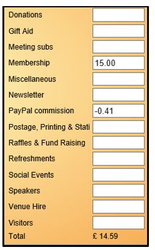

**7.9** **Working** **with** **PayPal**

> Back

Before members can join and renew online a PayPal account needs to be
set up and configured as describer in
[**7.9.1**](https://u3abeacon.zendesk.com/hc/en-gb/articles/360007430537)
[**Setting** **up** **Online** **Membership**
**Payments**](https://u3abeacon.zendesk.com/hc/en-gb/articles/360007430537)

Using PayPal

Beacon makes a direct connection with PayPal using the email address of
your PayPal account. When someone pays for an online membership
application or renewal via PayPal, the amount they have paid is
transmitted to Beacon automatically.

>  style="width:2.65625in;height:4.26042in" />**We** **suggest** **that**
> **you** **check** **the** **current** **figures** **and** **costs**
> **directly** **with** **PayPal.**
>
> The amount is divided between that paid to the u3a and that retained
> by PayPal as commission.
>
> To The net amount is posted to Beacon's PayPal Account, which should
> reflect the balance on your account with PayPal. The gross amount on
> the associated Beacon Transaction is categorised as **Membership** and
> the negative commission is categorised as **PayPal** **Commission**.

Each online transaction will generate confirmation emails that are sent
to the member and to the U3A’s PayPal email account.

From time to time your treasurer will transfer money from your PayPal
account to your U3A bank account.

**Please** **check** **with** **PayPal** **for** **actual** **costs**
**applying** **at** **the** **time.** This transfer must be reflected in
Beacon using the **Transfer** **Money** facility [(**<u>see
7.3</u>**)](https://u3abeacon.zendesk.com/hc/en-gb/articles/360007304257-7-3-Transfer-Money).

*Note:* *Beacon* *does* *not* *have* *access* *to* *or* *store* *any*
*card* *details* *or* *other* *financial* *information.* *These* *are*
*all* *handled* *exclusively* *by* *PayPal.*

**Revision** **History**

||
||
||
||
||
||
