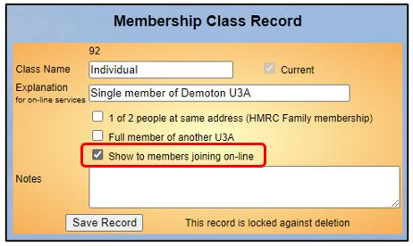
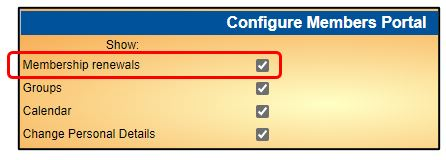
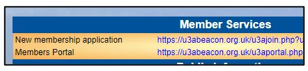
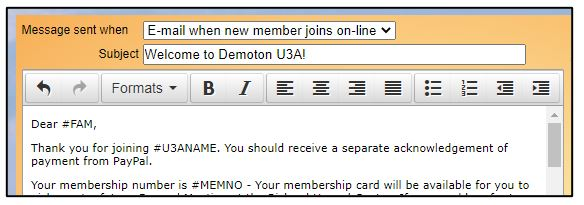
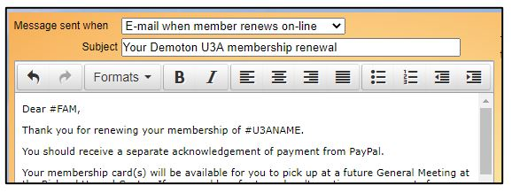

**7.9.1** **Setting** **up** **Online** **Membership**
**Payments**

> Back

This page describes the steps that are required to set up Online
Membership Payments for your U3A.

Registering to use PayPal

To accept payment on-line for members joining or renewing their
membership, your u3a will need to set up its own PayPal account with
associated email address and register as a charity with PayPal. You will
be asked to provide the u3a bank account details and other information
which they will verify before confirming your account details. Further
Information about setting up a PayPal account for your u3a is described
in [**9.8** **Setup** **On-line** **Transactions**
**(PayPal)**](https://u3abeacon.zendesk.com/hc/en-gb/articles/360011265558)

Site Configuration

After you have set up an account with PayPal, your Beacon Site will need
to be re-configured by the Beacon Support Team. This simple operation
includes creation of a Beacon **Finance** **Account** called **PayPal**
and a Beacon **Finance** **Category** called **PayPal** **Commission**.

Raise a ticket with the [**<u>Ongoing Help
team</u>**](https://u3abeacon.zendesk.com/hc/en-gb/articles/360007478557-Open-a-Support-Ticket)
for this to be done.

Update your System Settings

Click **System** **settings** on the Home Page and add the required
PayPal information for your u3a.

**Online** **enquiries**: The email address for enquiries about online
renewals and joining. **PayPal** **account** **email**: The email
address of your PayPal account

**PayPal** **cancel** **return** **URL**: The webpage to return to if a
PayPal transaction is cancelled for any reason

If the **Email** **membership** **cards** box is ticked, a membership
card will be attached to the confirmation email that is automatically
sent to the member when they join or renew online.

You may also wish to review your **Advance** **Renewals** and **Grace**
**Lapse** periods. Online renewals are only available from the start of
the Advance Renewals period and are no longer available to a member
after their membership has been lapsed.

Update your Membership Classes

Go to the **Membership** **Classes** page and make sure that ***Show***
***to*** ***members*** ***joining*** ***online*** is ticked for each

Membership Class that you want to be available for new members joining
online.

Update the Public Links page

Go to the Public Links page and make sure that ***Membership***
***Renewals*** is ticked in the **Configure** **Members** **Portal**
section.

In the **Member** **Services** section on the same page, there are links
for New Membership Applications and the Members Portal that you can copy
to an appropriate position on your u3a's website, and/or include in
emails that you send out to your members.

Update your System Messages

Go to the **System** **Messages** page, where you will find the standard
message templates for emails that are automatically sent out to members
when they join or renew online. Check if you are happy with the wording
and update as necessary.

**Revision** **History**

||
||
||
