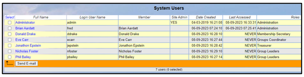
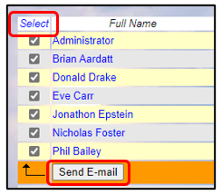
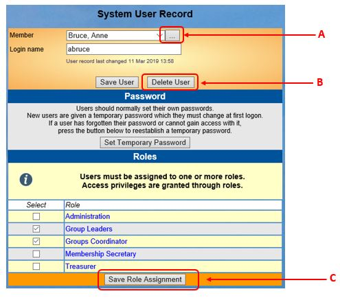
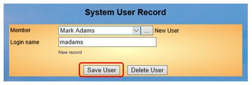
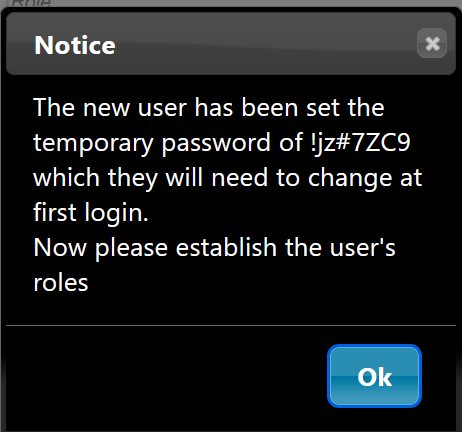

[u3a Beacon](https://u3abeacon.zendesk.com/hc/en-gb) \> [User
Guide](https://u3abeacon.zendesk.com/hc/en-gb/categories/360001240017-User-Guide)
\> [8. System
settings](https://u3abeacon.zendesk.com/hc/en-gb/sections/360002102838-8-System-settings)
Search

**Articles** **in** **this** **section**

**8.2** **System** **Users**

>  style="width:0.41667in;height:0.41667in" /> style="width:0.15625in;height:0.15625in" />Printable version Graeme
> Bunting Follow 6 months ago · Updated

The parts of Beacon described below are generally only available to the
**Site** **Administrator**.

This video gives background and context to the topic.

>  style="width:0.70833in;height:0.49975in" />[**System** **users**
> **2021-12-09**](https://www.youtube.com/watch?v=bziQTZCxD2E)

Viewing System Users

System Users are those members who are required to perform some
administration on the system, e.g. Committee, Group Leaders, etc. Access
is given according to the needs/requirements of their Roles and can be
varied depending on the committee's decision.

Click **System** **users** on the Home Page to view the list of users.
All users must be current u3a members.

>  style="width:1.125in;height:0.47892in" />**Help**

Sending Emails to System Users

To send an email to System Users click **Select** at the top of the
first column to select all the System Users, or tick individual users
one-by-one, before pressing the **Send** **E-mail** button.

When composing the email three additional \#Tokens are available.

||
||
||
||
||

Viewing User Records

Click on a blue Full Name to view the **System** **User** **Record.**

Pressing the button with three dots next to the Member name **\[A\]**
will take you to their individual **Member** **Record** [(see
4.2](https://u3abeacon.zendesk.com/hc/en-gb/articles/360007303097-4-2-Member-Record)).

The lower part of the form shows the **Roles** that the user has been
assigned ([see
8.2](https://u3abeacon.zendesk.com/hc/en-gb/articles/360007368078)).
After changing the Roles assigned to a user, press the **Save** **Role**
**Assignment** button **\[C\]**.

Adding New Users

Click **Add** **New** **User** from the System User list or an existing
System User Record. Select the name of the member from the drop-down
list and enter a Login name (username) in the field below.

Usernames can only have lower case letters or numbers with no blank
spaces and should be personal to the user (e.g. *jbloggs)*, rather than
relating to a role such as *Membership* *Secretary*.

**Please** **do** **not** **have** **duplicate** **Usernames.**

After pressing the **Save** **User** button, a message showing the
User’s temporary password and prompting you to establish the user’s
roles will be displayed. Make a note of the Username and Password (for
when you inform the user) and then click **OK** to dismiss the message.
A popular way to do this is to select and copy the password and paste it
into an e-mail.

Assigning Roles to a User

Every user, except the Site Administrator, must be assigned to one or
more Roles in order to access Beacon. Select the Roles required at the
bottom of the User Record and press the **Save** **Role** **Assignment**
button **\[C\]**.

[See
8.2](https://u3abeacon.zendesk.com/hc/en-gb/articles/360007304437-8-2-Roles-and-Privileges)
for details of how to create and edit Roles and Privileges.

Please note if you give a Group Leader privileges to someone then they
will have access to all groups of which they are a leader. You do not
need to set separate User rights for each group.

It is also beneficial for each user to have a single User name and
password with all roles ticked on a single Users record. This means
there are less Users to maintain and reduces the number of passwords,
user names an individual has to remember. If they cease being in a role
you can just untick this role from their User record.

Re-setting a User's Password

It is not possible to ascertain a user's password, so if a user forgets
theirs the only options are for the user to click the **Forgotten**
**your** **username** **or** **password** link on the Beacon log-in
page, or for the Site Administrator to re-set the password.

To re-set a user's password click **System** **users** on the Home Page,
open their User Record and press the **Set** **Temporary** **Password**
button. You will need to notify the user of their new password and they
will have to change their password on first use.

Deleting a System User

You should ensure that where access to Beacon is no longer required,
System Users are deleted by pressing **Delete** **User**
**\[B\]**.

*Please* *note* *this* *will* *only* *remove* *their* *ability* *to*
*log* *into* *Beacon* *it* *will* *still* *leave* *the* *individual's*
*Member* *Record.*

*Also,* *if* *a* *member* *is* *changed* *to* *a* *non-current* *status*
*such* *as* ***Lapsed*** *or* ***Deceased**,* *they* *will* *be*
*automatically* *be* *removed* *from* *the* *System* *Users* *List*

Revision History

||
||
||
||
||
||
||
||
||

> Was this article helpful?
>
> Yes No
>
> 3 out of 3 found this helpful
>
> Have more questions? [<u>Submit a
> request</u>](https://u3abeacon.zendesk.com/hc/en-gb/requests/new)

Return to top

**Recently** **viewed** **articles** [8.1 The Site
Administrator](https://u3abeacon.zendesk.com/hc/en-gb/articles/360007445138-8-1-The-Site-Administrator)

[2. Logging in as a System
User](https://u3abeacon.zendesk.com/hc/en-gb/articles/360007072538-2-Logging-in-as-a-System-User)

[8 Set-Up
Operations](https://u3abeacon.zendesk.com/hc/en-gb/articles/360007304417-8-Set-Up-Operations)

[8.4.1 Privileges Map and default
Privileges](https://u3abeacon.zendesk.com/hc/en-gb/articles/360007389637-8-4-1-Privileges-Map-and-default-Privileges)

[8.3 System
Settings](https://u3abeacon.zendesk.com/hc/en-gb/articles/360007304457-8-3-System-Settings)

**Related** **articles**

[8.4 Roles and
Privileges](https://u3abeacon.zendesk.com/hc/en-gb/related/click?data=BAh7CjobZGVzdGluYXRpb25fYXJ0aWNsZV9pZGwrCPWEG9JTADoYcmVmZXJyZXJfYXJ0aWNsZV9pZGwrCI59HNJTADoLbG9jYWxlSSIKZW4tZ2IGOgZFVDoIdXJsSSI9L2hjL2VuLWdiL2FydGljbGVzLzM2MDAwNzMwNDQzNy04LTQtUm9sZXMtYW5kLVByaXZpbGVnZXMGOwhUOglyYW5raQY%3D--3bfbc9c4d7025cf965983cc6f387005061447625)

[8.1 The Site
Administrator](https://u3abeacon.zendesk.com/hc/en-gb/related/click?data=BAh7CjobZGVzdGluYXRpb25fYXJ0aWNsZV9pZGwrCJKqHdJTADoYcmVmZXJyZXJfYXJ0aWNsZV9pZGwrCI59HNJTADoLbG9jYWxlSSIKZW4tZ2IGOgZFVDoIdXJsSSI%2FL2hjL2VuLWdiL2FydGljbGVzLzM2MDAwNzQ0NTEzOC04LTEtVGhlLVNpdGUtQWRtaW5pc3RyYXRvcgY7CFQ6CXJhbmtpBw%3D%3D--5e1449f27db94d50e1c5bf5608a5105df7e307a3)

[8.2.1 How to easily contact all of your
Users](https://u3abeacon.zendesk.com/hc/en-gb/related/click?data=BAh7CjobZGVzdGluYXRpb25fYXJ0aWNsZV9pZGwrCJGEISanBDoYcmVmZXJyZXJfYXJ0aWNsZV9pZGwrCI59HNJTADoLbG9jYWxlSSIKZW4tZ2IGOgZFVDoIdXJsSSJTL2hjL2VuLWdiL2FydGljbGVzLzUxMTU5NDU3ODAzNjktOC0yLTEtSG93LXRvLWVhc2lseS1jb250YWN0LWFsbC1vZi15b3VyLVVzZXJzBjsIVDoJcmFua2kI--e2e121324fd69873566eda2699e22fc115c533cb)

[Demo System Getting
Started](https://u3abeacon.zendesk.com/hc/en-gb/related/click?data=BAh7CjobZGVzdGluYXRpb25fYXJ0aWNsZV9pZGwrCEK4HtJTADoYcmVmZXJyZXJfYXJ0aWNsZV9pZGwrCI59HNJTADoLbG9jYWxlSSIKZW4tZ2IGOgZFVDoIdXJsSSJAL2hjL2VuLWdiL2FydGljbGVzLzM2MDAwNzUxNDE3OC1EZW1vLVN5c3RlbS1HZXR0aW5nLVN0YXJ0ZWQGOwhUOglyYW5raQk%3D--e67436691cd32b6a6a36a0639ac91c1d3d01c78c)

[6.1.1 Sending
Emails](https://u3abeacon.zendesk.com/hc/en-gb/related/click?data=BAh7CjobZGVzdGluYXRpb25fYXJ0aWNsZV9pZGwrCNatHNJTADoYcmVmZXJyZXJfYXJ0aWNsZV9pZGwrCI59HNJTADoLbG9jYWxlSSIKZW4tZ2IGOgZFVDoIdXJsSSI5L2hjL2VuLWdiL2FydGljbGVzLzM2MDAwNzM4MDQzOC02LTEtMS1TZW5kaW5nLUVtYWlscwY7CFQ6CXJhbmtpCg%3D%3D--243bca7c281ec2ae9b6a520e74f1fe9790704f26)

**Comments** 0 comments

Please [<u>sign
in</u>](https://u3abeacon.zendesk.com/access?locale=en-gb&brand_id=360000694158&return_to=https%3A%2F%2Fu3abeacon.zendesk.com%2Fhc%2Fen-gb%2Farticles%2F360007368078-8-2-System-Users)
to leave a comment.

[u3a Beacon](https://u3abeacon.zendesk.com/hc/en-gb)

> [<u>Powered by
> Zendesk</u>](https://www.zendesk.co.uk/service/help-center/?utm_source=helpcenter&utm_medium=poweredbyzendesk&utm_campaign=text&utm_content=u3a+Beacon+Support)
