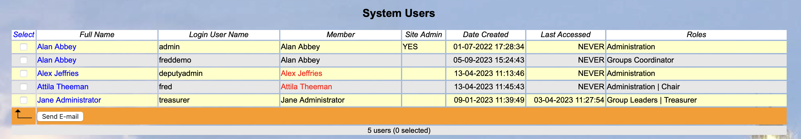
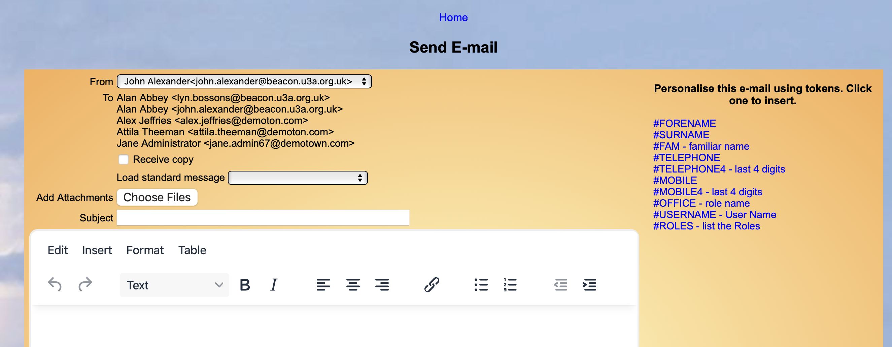

[u3a Beacon](https://u3abeacon.zendesk.com/hc/en-gb) \> [User
Guide](https://u3abeacon.zendesk.com/hc/en-gb/categories/360001240017-User-Guide)
\> [8. System
settings](https://u3abeacon.zendesk.com/hc/en-gb/sections/360002102838-8-System-settings)
Search

**Articles** **in** **this** **section**

**8.2.1** **How** **to** **easily** **contact** **all** **of** **your**
**Users**

>  style="width:0.41667in;height:0.41667in" />John Alexander Follow 2
> years ago · Updated

A number of site administrators have asked how they can easily contact
all of their users. who sign in such as Group Leaders etc but excluding
members who use the Membership Portal.

A facility was added which is shown below.

On the left side is a Select option and you can then send an e-mail to
those selected.

When you select Send e-mail you get the standard e-mail screen but with
tokens specific to this set of User as shown below.

>  style="width:7.4375in;height:2.91667in" /> style="width:1.125in;height:0.47892in" />**Help**

**Revision** **History**

||
||
||
||

> Was this article helpful?
>
> Yes No
>
> 0 out of 1 found this helpful
>
> Have more questions? [<u>Submit a
> request</u>](https://u3abeacon.zendesk.com/hc/en-gb/requests/new)

Return to top

**Recently** **viewed** **articles** [8.1 The Site
Administrator](https://u3abeacon.zendesk.com/hc/en-gb/articles/360007445138-8-1-The-Site-Administrator)

[8.1 a Suggestion for new sites re
Existing](https://u3abeacon.zendesk.com/hc/en-gb/articles/27563693223325-8-1-a-Suggestion-for-new-sites-re-Existing-Membership)
[Membership](https://u3abeacon.zendesk.com/hc/en-gb/articles/27563693223325-8-1-a-Suggestion-for-new-sites-re-Existing-Membership)

[8 Set-Up
Operations](https://u3abeacon.zendesk.com/hc/en-gb/articles/360007304417-8-Set-Up-Operations)

[7.10.7
Refunds](https://u3abeacon.zendesk.com/hc/en-gb/articles/21268054883613-7-10-7-Refunds)

[7.10.6 Opening Balance for
Groups](https://u3abeacon.zendesk.com/hc/en-gb/articles/19232714658461-7-10-6-Opening-Balance-for-Groups)

**Related** **articles** [8.3 System
Settings](https://u3abeacon.zendesk.com/hc/en-gb/related/click?data=BAh7CjobZGVzdGluYXRpb25fYXJ0aWNsZV9pZGwrCAmFG9JTADoYcmVmZXJyZXJfYXJ0aWNsZV9pZGwrCJGEISanBDoLbG9jYWxlSSIKZW4tZ2IGOgZFVDoIdXJsSSI4L2hjL2VuLWdiL2FydGljbGVzLzM2MDAwNzMwNDQ1Ny04LTMtU3lzdGVtLVNldHRpbmdzBjsIVDoJcmFua2kG--b5e2bde0b4c06bb0c3bc2e8372d123607324e72f)

[6.1.1 Sending
Emails](https://u3abeacon.zendesk.com/hc/en-gb/related/click?data=BAh7CjobZGVzdGluYXRpb25fYXJ0aWNsZV9pZGwrCNatHNJTADoYcmVmZXJyZXJfYXJ0aWNsZV9pZGwrCJGEISanBDoLbG9jYWxlSSIKZW4tZ2IGOgZFVDoIdXJsSSI5L2hjL2VuLWdiL2FydGljbGVzLzM2MDAwNzM4MDQzOC02LTEtMS1TZW5kaW5nLUVtYWlscwY7CFQ6CXJhbmtpBw%3D%3D--cdbfa3c4b49dbb75eae7e62543cf7a471e1a60c8)

[8.2 System
Users](https://u3abeacon.zendesk.com/hc/en-gb/related/click?data=BAh7CjobZGVzdGluYXRpb25fYXJ0aWNsZV9pZGwrCI59HNJTADoYcmVmZXJyZXJfYXJ0aWNsZV9pZGwrCJGEISanBDoLbG9jYWxlSSIKZW4tZ2IGOgZFVDoIdXJsSSI1L2hjL2VuLWdiL2FydGljbGVzLzM2MDAwNzM2ODA3OC04LTItU3lzdGVtLVVzZXJzBjsIVDoJcmFua2kI--33ae4da2c649af7e6fcf5ad3202ccd0917ef35d9)

[8.4.1 Privileges Map and default
Privileges](https://u3abeacon.zendesk.com/hc/en-gb/related/click?data=BAh7CjobZGVzdGluYXRpb25fYXJ0aWNsZV9pZGwrCMXRHNJTADoYcmVmZXJyZXJfYXJ0aWNsZV9pZGwrCJGEISanBDoLbG9jYWxlSSIKZW4tZ2IGOgZFVDoIdXJsSSJQL2hjL2VuLWdiL2FydGljbGVzLzM2MDAwNzM4OTYzNy04LTQtMS1Qcml2aWxlZ2VzLU1hcC1hbmQtZGVmYXVsdC1Qcml2aWxlZ2VzBjsIVDoJcmFua2kJ--7e977a10a1993bad54a2ceeb9722c21e0337d74b)

[8.1 The Site
Administrator](https://u3abeacon.zendesk.com/hc/en-gb/related/click?data=BAh7CjobZGVzdGluYXRpb25fYXJ0aWNsZV9pZGwrCJKqHdJTADoYcmVmZXJyZXJfYXJ0aWNsZV9pZGwrCJGEISanBDoLbG9jYWxlSSIKZW4tZ2IGOgZFVDoIdXJsSSI%2FL2hjL2VuLWdiL2FydGljbGVzLzM2MDAwNzQ0NTEzOC04LTEtVGhlLVNpdGUtQWRtaW5pc3RyYXRvcgY7CFQ6CXJhbmtpCg%3D%3D--ce824b6bd45295d275fb65b9377dedb2c8aa153a)

**Comments** 0 comments

Please [<u>sign
in</u>](https://u3abeacon.zendesk.com/access?locale=en-gb&brand_id=360000694158&return_to=https%3A%2F%2Fu3abeacon.zendesk.com%2Fhc%2Fen-gb%2Farticles%2F5115945780369-8-2-1-How-to-easily-contact-all-of-your-Users)
to leave a comment.

[u3a Beacon](https://u3abeacon.zendesk.com/hc/en-gb)

> [<u>Powered by
> Zendesk</u>](https://www.zendesk.co.uk/service/help-center/?utm_source=helpcenter&utm_medium=poweredbyzendesk&utm_campaign=text&utm_content=u3a+Beacon+Support)
