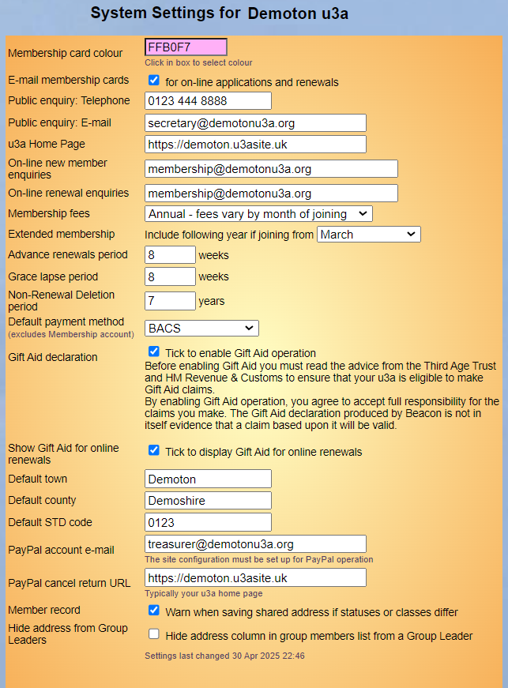

[u3a Beacon](https://u3abeacon.zendesk.com/hc/en-gb) \> [User
Guide](https://u3abeacon.zendesk.com/hc/en-gb/categories/360001240017-User-Guide)
\> [8. System
settings](https://u3abeacon.zendesk.com/hc/en-gb/sections/360002102838-8-System-settings)
Search

**Articles** **in** **this** **section**

**8.3** **System** **Settings**

>  style="width:0.41667in;height:0.41667in" /> style="width:0.15625in;height:0.15625in" />Graeme Bunting Follow 12
> days ago · Updated

The parts of Beacon described below are generally only available to the
Site Administrator.

Click **System** **settings** on the Home Page to set the parameters for
the operation of Beacon within your u3a.

>  style="width:1.125in;height:0.47892in" />**Help**

Working from top to bottom, the parameters to set are:

> **Membership** **card** **colour:** The colour of the band on
> membership cards.
>
> **E-mail** **membership** **cards**: tick to attach membership cards
> to the confirmation email that is sent when people join or renew
> online (if enabled). You should also change the system messages that
> are sent reflect the fact that there is, or isn't, a membership card
> attached ([see
> 8.4)](https://u3abeacon.zendesk.com/knowledge/articles/360007309657/en-gb?brand_id=360000694158).

**Public** **enquiry**: telephone and email address for general
enquiries from the public.

**u3a** **home** **page**: The home page on your u3a website.

**Online** **new** **member** **enquiries**: Email address for enquiries
about online joining.

**Online** **renewal** **enquiries**: Email address for enquiries about
online renewals.

**Membership** **fees:** Choose **same** **fees** **all** **year**, or
**fees** **vary** **by** **month** **of** **joining** (The Rolling
Membership pick in the drop-down list is not supported for new sites).

**Extended** **membership**: The month from which new memberships can
include the following year, e.g. if your membership year starts in
April, you may allow members joining in March to have 13 months
membership on payment of the 12 month fee.

**Advance** **renewals** **period**: The number of weeks before the
start of the membership year that renewals can be processed.

**Grace** **lapse** **period**: The number of weeks after the start of
the membership year that before members are considered not to have
renewed and can have their status changed to **Lapsed**.

**Non-renewal** **Deletion** **period**: The number of years after which
long term lapsed members may be selected for bulk deletion. Note: The
default 7 years can be changed to any whole number from 2 to 7 and will
be available in the Non-renewals screen options [(see 4.6
Non-Renewals](https://u3abeacon.zendesk.com/hc/en-gb/articles/360007304297))

**Default** **payment** **method**: this is now applied only to
Transactions excluding Membership. Membership Defaults ([see 8.6 Finance
Set-up)](https://u3abeacon.zendesk.com/hc/en-gb/articles/360007304477)

**Gift** **Aid** **declaration**: Tick to enable Gift Aid claims ([see
7.8 Gift
Aid](https://u3abeacon.zendesk.com/hc/en-gb/articles/360007304397-7-8-Gift-Aid)).

**Show** **Gift** **Aid** **for** **online** **renewals**: Tick to
display the Gift Aid tick boxes for online renewals.

**Default** **town,** **county,** **STD** **code**: defaults values that
will be inserted during creation of new Membership Records. They can be
overridden at the time of creating a new record. If a default STD code
is left in place without the addition of the telephone number, it is
automatically removed upon saving.

**PayPal** **account** **email**: Email address for your Paypal account
(if PayPal is enabled).

**PayPal** **cancel** **return** **URL**: The webpage to return to after
a Paypal transaction is cancelled (if PayPal is enabled).

**Member** **record**: tick to enable a warning message when saving
shared addresses if the statuses or classes differ.

> **Hide** **Address** **from** **group** **leaders**: as of February
> 2026 this setting has no effect and will be removed in the future. It
> has been replaced by a Site Administrator being able to set this from
> the [Groups List
> 5.1](https://u3abeacon.zendesk.com/hc/en-gb/articles/360007304217).

After making any changes press the **Update** button to commit the
changes to your System Settings.

Revision History

||
||
||
||
||
||
||
||

>  style="width:0.1875in;height:0.18725in" />1
>
> Was this article helpful?
>
> Yes No
>
> 0 out of 0 found this helpful
>
> Have more questions? [<u>Submit a
> request</u>](https://u3abeacon.zendesk.com/hc/en-gb/requests/new)

Return to top

**Recently** **viewed** **articles** [8 Set-Up
Operations](https://u3abeacon.zendesk.com/hc/en-gb/articles/360007304417-8-Set-Up-Operations)

[7.8 Gift
Aid](https://u3abeacon.zendesk.com/hc/en-gb/articles/360007304397-7-8-Gift-Aid)

[4.3.2 Shared Addresses & Joint
Members](https://u3abeacon.zendesk.com/hc/en-gb/articles/360019697318-4-3-2-Shared-Addresses-Joint-Members)

[4.3.1 Addresses & Phone
Numbers](https://u3abeacon.zendesk.com/hc/en-gb/articles/360019547517-4-3-1-Addresses-Phone-Numbers)

[4.2 Member
Record](https://u3abeacon.zendesk.com/hc/en-gb/articles/360007303097-4-2-Member-Record)

**Comments** 1 comment

>  style="width:0.41667in;height:0.41667in" />Mike Watts

**Related** **articles**

[8.7 Membership
Set-up](https://u3abeacon.zendesk.com/hc/en-gb/related/click?data=BAh7CjobZGVzdGluYXRpb25fYXJ0aWNsZV9pZGwrCDGFG9JTADoYcmVmZXJyZXJfYXJ0aWNsZV9pZGwrCAmFG9JTADoLbG9jYWxlSSIKZW4tZ2IGOgZFVDoIdXJsSSI6L2hjL2VuLWdiL2FydGljbGVzLzM2MDAwNzMwNDQ5Ny04LTctTWVtYmVyc2hpcC1TZXQtdXAGOwhUOglyYW5raQY%3D--36cfea6736b326bce2f1aec3e30bc30bd5c4d4b1)

[8.6 Finance
Set-up](https://u3abeacon.zendesk.com/hc/en-gb/related/click?data=BAh7CjobZGVzdGluYXRpb25fYXJ0aWNsZV9pZGwrCB2FG9JTADoYcmVmZXJyZXJfYXJ0aWNsZV9pZGwrCAmFG9JTADoLbG9jYWxlSSIKZW4tZ2IGOgZFVDoIdXJsSSI3L2hjL2VuLWdiL2FydGljbGVzLzM2MDAwNzMwNDQ3Ny04LTYtRmluYW5jZS1TZXQtdXAGOwhUOglyYW5raQc%3D--16ddcd38a5925eea2a807001f4a1fab8551f2fd8)

[7.8 Gift
Aid](https://u3abeacon.zendesk.com/hc/en-gb/related/click?data=BAh7CjobZGVzdGluYXRpb25fYXJ0aWNsZV9pZGwrCM2EG9JTADoYcmVmZXJyZXJfYXJ0aWNsZV9pZGwrCAmFG9JTADoLbG9jYWxlSSIKZW4tZ2IGOgZFVDoIdXJsSSIxL2hjL2VuLWdiL2FydGljbGVzLzM2MDAwNzMwNDM5Ny03LTgtR2lmdC1BaWQGOwhUOglyYW5raQg%3D--c9c2eee2abb502d6150f79db6e6dd5aa4bc8b3ab)

[4.5 Membership
Renewals](https://u3abeacon.zendesk.com/hc/en-gb/related/click?data=BAh7CjobZGVzdGluYXRpb25fYXJ0aWNsZV9pZGwrCHZ8HNJTADoYcmVmZXJyZXJfYXJ0aWNsZV9pZGwrCAmFG9JTADoLbG9jYWxlSSIKZW4tZ2IGOgZFVDoIdXJsSSI8L2hjL2VuLWdiL2FydGljbGVzLzM2MDAwNzM2Nzc5OC00LTUtTWVtYmVyc2hpcC1SZW5ld2FscwY7CFQ6CXJhbmtpCQ%3D%3D--a0f335563bb0b75fa1d78e29ff1bd8987df62b5c)

[8.9 Considerations when changing fees
and](https://u3abeacon.zendesk.com/hc/en-gb/related/click?data=BAh7CjobZGVzdGluYXRpb25fYXJ0aWNsZV9pZGwrCHW5INJTADoYcmVmZXJyZXJfYXJ0aWNsZV9pZGwrCAmFG9JTADoLbG9jYWxlSSIKZW4tZ2IGOgZFVDoIdXJsSSJfL2hjL2VuLWdiL2FydGljbGVzLzM2MDAwNzY0NTU1Ny04LTktQ29uc2lkZXJhdGlvbnMtd2hlbi1jaGFuZ2luZy1mZWVzLWFuZC1tZW1iZXJzaGlwLXllYXJzBjsIVDoJcmFua2kK--2d46aed3f6de4b40b6d5ac5f4abbfcd34e645143)
[membership
years](https://u3abeacon.zendesk.com/hc/en-gb/related/click?data=BAh7CjobZGVzdGluYXRpb25fYXJ0aWNsZV9pZGwrCHW5INJTADoYcmVmZXJyZXJfYXJ0aWNsZV9pZGwrCAmFG9JTADoLbG9jYWxlSSIKZW4tZ2IGOgZFVDoIdXJsSSJfL2hjL2VuLWdiL2FydGljbGVzLzM2MDAwNzY0NTU1Ny04LTktQ29uc2lkZXJhdGlvbnMtd2hlbi1jaGFuZ2luZy1mZWVzLWFuZC1tZW1iZXJzaGlwLXllYXJzBjsIVDoJcmFua2kK--2d46aed3f6de4b40b6d5ac5f4abbfcd34e645143)

> Sort by
>
> 5 years ago
>
> 0

It's all very well being able
to set these but where are they used? For instance Public enquiry
Telephone and Email, where are these displayed. It is not clear.

Article is closed for comments.

[u3a Beacon](https://u3abeacon.zendesk.com/hc/en-gb)

> [<u>Powered by
> Zendesk</u>](https://www.zendesk.co.uk/service/help-center/?utm_source=helpcenter&utm_medium=poweredbyzendesk&utm_campaign=text&utm_content=u3a+Beacon+Support)
