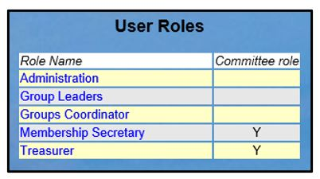
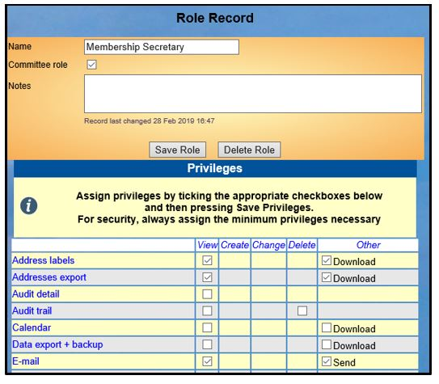
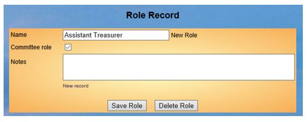
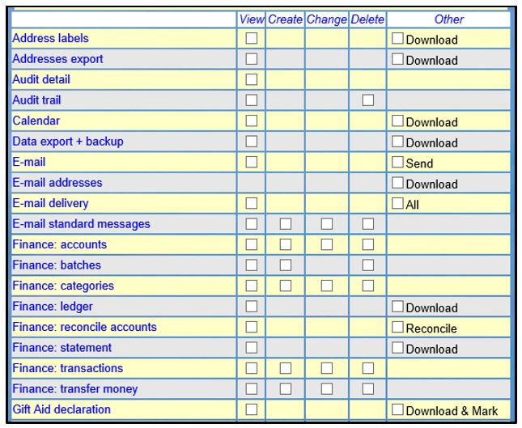
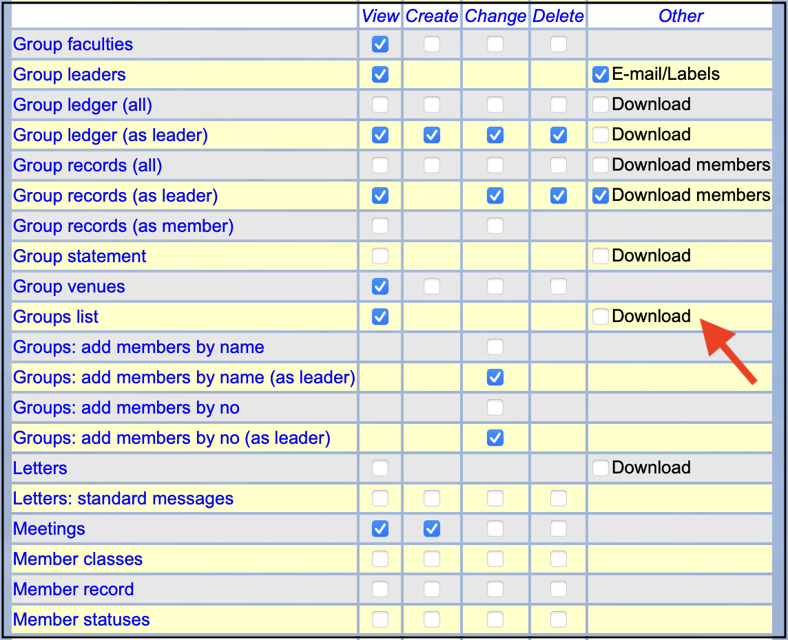
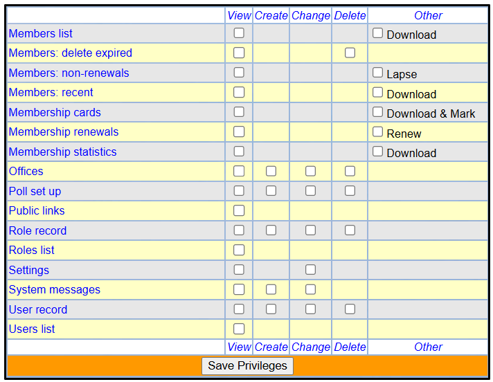

**8.4** **Roles** **and** **Privileges**

> Back

The parts of Beacon described below are generally only available to the
**Site** **Administrator**.

This video gives background and context to the topic.

>  style="width:0.70833in;height:0.49976in" />[**Roles** **and**
> **Privileges**
> **2021-12-12**](https://www.youtube.com/watch?v=ajyeysSC0Ho)

Definitions

**Roles** are the means by which access **Privileges** are assigned to
users. Privileges determine which parts of Beacon a user may access and
the tasks they may carry out according to their role requirements.

Privileges are allocated to Roles (not people). Roles should be
considered as being equivalent to 'jobs', whereas users are people. When
the person carrying out a particular job changes, the Roles allocated to
their User Record will need to be updated and another user may need to
be assigned to the Role. The Role itself, and the Privileges attached to
the Role, should not normally need to be changed.

To display a list of Roles, click **Roles** **and** **privileges** from
the Home Page.

When a u3a adopts the Beacon System, the following default Roles are
already set up:

>  style="width:3.92708in;height:2.1875in" />Administration style="width:5.65625in;height:4.94792in" />
>
> Group Leader
>
> Groups Coordinator
>
> Membership Secretary
>
> Treasurer

Click on a Role Name to view the **Role** **Record** and associated
Privileges.

When editing a Role, click all the boxes that the Role requires and
press the **Save** **Role** button to commit the changes. If a Role is
no longer required, you can press the **Delete** **Role** button to
remove the Role from the system.

Adding a new Role

Click **Add** **Role** from the list of roles or an existing Role
Record. Give the Role a name and tick the box if it is a committee Role,
before pressing the **Save** **Role** button.

Assigning Privileges to a Role

Under the **Privileges** heading, assign the Privileges required for the
Role.

For good security, always assign the minimum privileges necessary to
carry out the required administration/functions of the role (avoiding
the ‘nice to have’ options).

Clicking on a row or column header will toggle all privileges in that
row/column.

To remove privileges, simply untick the corresponding checkboxes.

Privileges refer to distinct parts of Beacon and are subdivided, as
applicable, with separate access rights for **viewing** records,
**creating** new records, **changing** existing records and
**deleting.** Note that the privilege to view will be required for
anyone who needs to create, change or delete a record.

Separate privileges are assigned to operations such as downloading
documents, sending emails, etc. Users will not be able to send emails if
their roles are not assigned the **Email:** **Send**

Group operations sometimes apply separately to '**all**', '**as**
**leader**' and '**as** **member'**. Roles that are assigned 'all'
privileges can access the records for all groups. Those assigned 'as
leader' can only access the groups of which the user is a leader. Those
assigned 'as member' can only access the groups of which the user is an
individual member.

Operations such as '**Member** **classes**' refer to setting up
membership classes, not the selection of classes in Member Records, for
example. Operation names often correspond to similar names on the Home
Page.

Press the **Save** **Privileges** button to commit the allocation of
Privileges to a Role.

Note that roles are additive in that you can assign more than one role
to a User and they will have the combined Privileges of the Roles. This
can be useful if you want a role that extends an exiting role with an
extra Privilege. For example, to give a Group Leader the ability to see
the whole membership list define a role **Group** **Leader** **Plus**
with just **Members** **list** ticked. Then assign both **Group**
**Leader** and **Group** **Leader** **Plus** Roles to the Group Leader
concerned.

Privileges Available

Refer to the [<u>Privileges Map and default
Privileges</u>](https://u3abeacon.zendesk.com/hc/en-gb/articles/360007389637)
to see how the tick boxes on the Role Record page (below) relate to
operations within Beacon. The default privileges lists the default Roles
when a new Beacon site is created.

These are the recommended
default Privileges for with these Roles - However a lot is dependent on
who does what duties in your u3a.

Please note the new facility so a Group Leader can be given the ability
to download the Group List.

Recommendation

When setting up the Roles and Privileges for the first time, it can help
you understanding of Roles and Privileges if you do the following:

> 1\. Create an ‘ordinary’ System User for yourself (if you don’t have
> one already).
>
> 2\. Allocate one or more Roles to your ordinary user account.
>
> 3\. Log out of Beacon and log back in using your ordinary user account
> so that you can explore the functionality available with the Role to
> see if it meets your requirements. This way you can easily identify if
> you have missed something or need to change anything before allocating
> it to the real role holder.
>
> 4\. After you have finished testing, log back in as Admin and
> re-allocate the real Roles to your ordinary user account.

**Revision** **History**

||
||
||
||
||
||
||
||
||
