**8.4.1** **Privileges** **Map** **and** **default**
**Privileges**

> Back

The table below defines how the tick boxes on the **Role** **Record**
page relate to operations within Beacon.

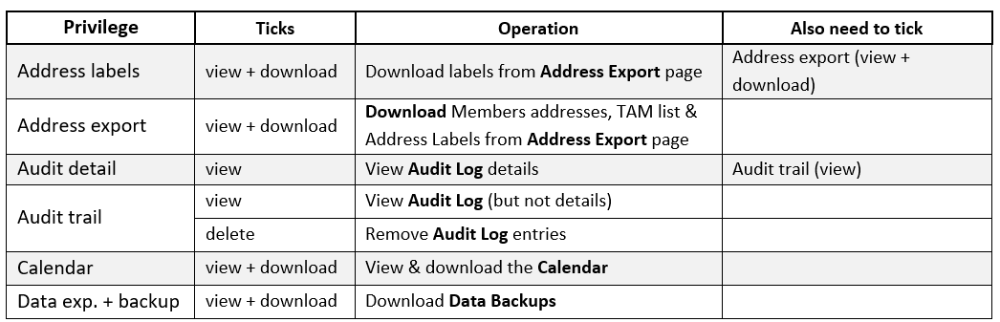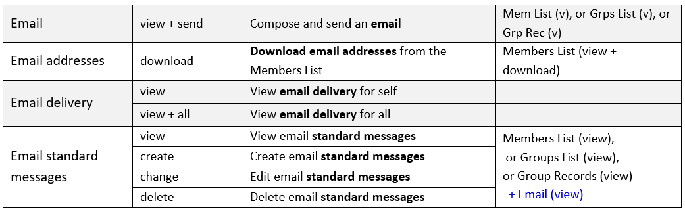Refer to the default
privileges map that follows to see the Privileges allocated to the
default Roles when a new Beacon site is created. Please note that it is
very likely that individual sites will vary these to meet specific
needs.

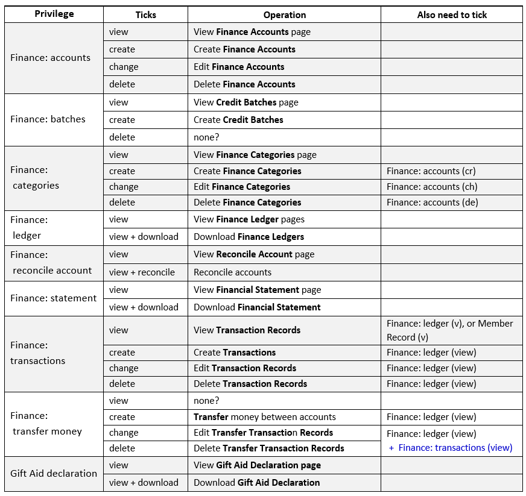

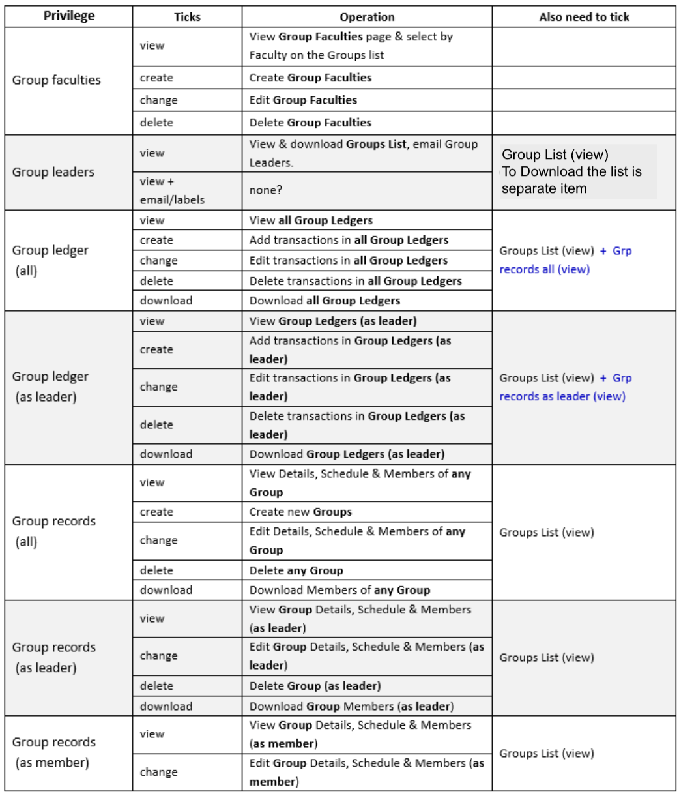

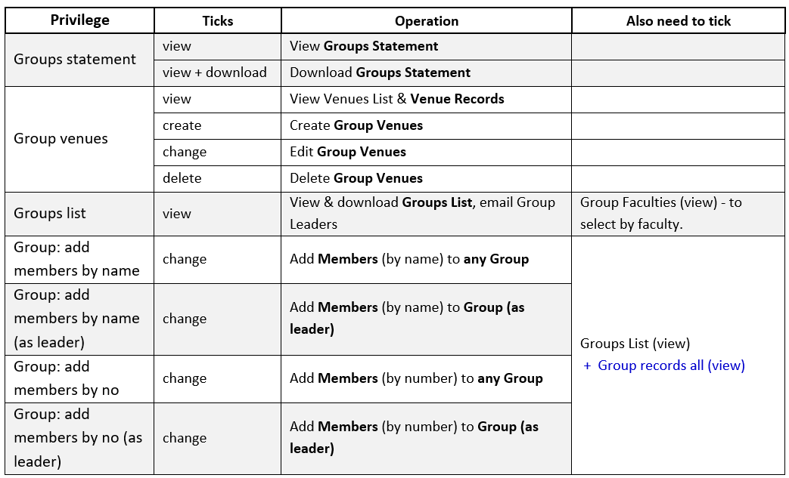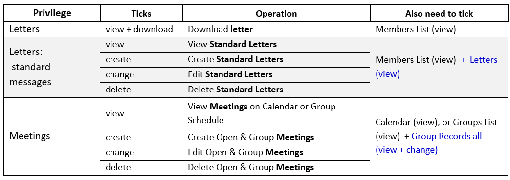

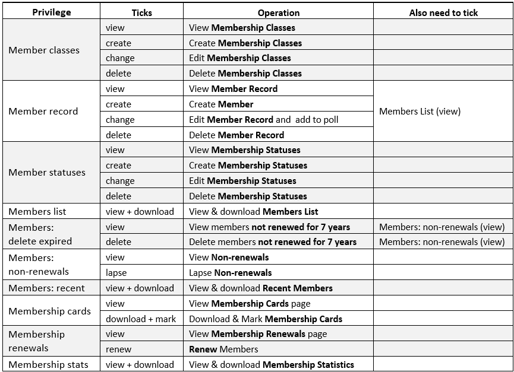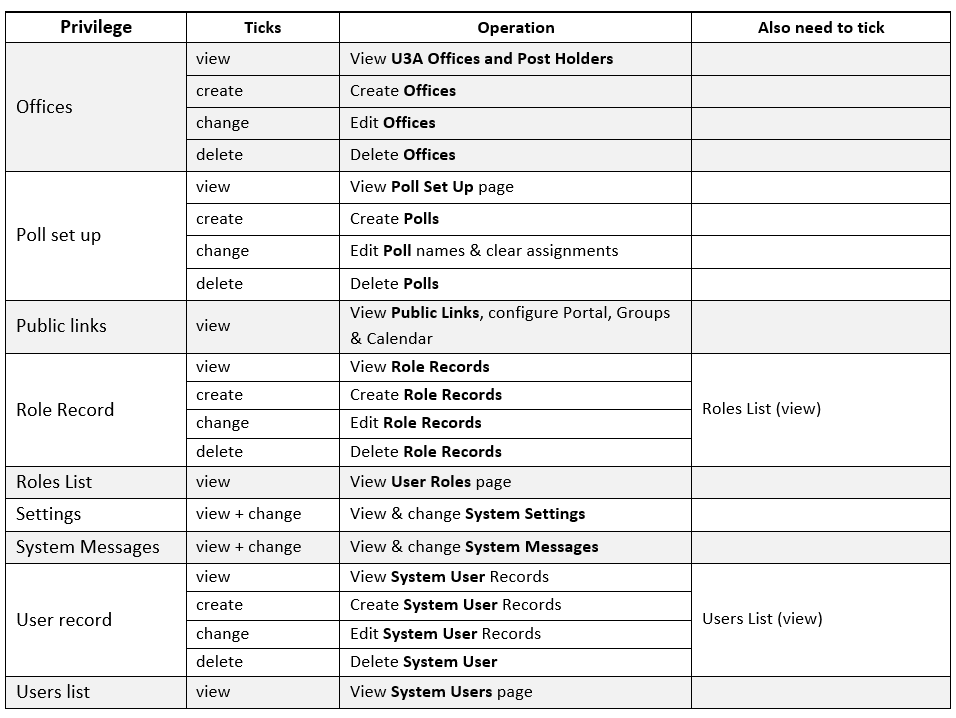

**Default** **Privileges** **Map**

When a new Beacon site is created the following default **Roles** are
created:

Administration Group Leader Groups Co-ordinator

Membership Secretary Treasurer

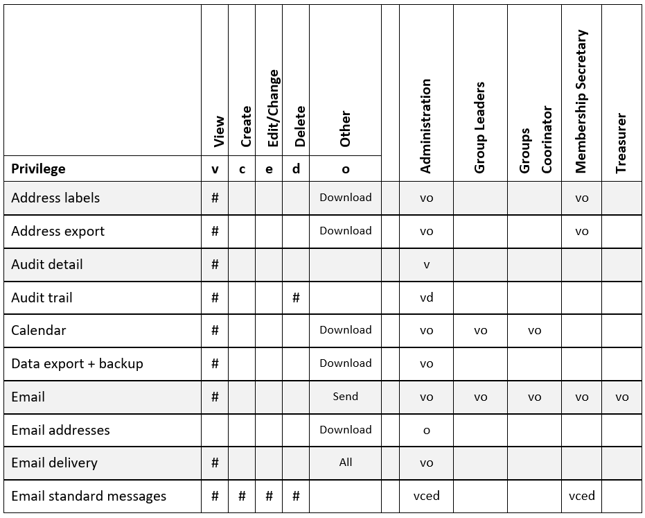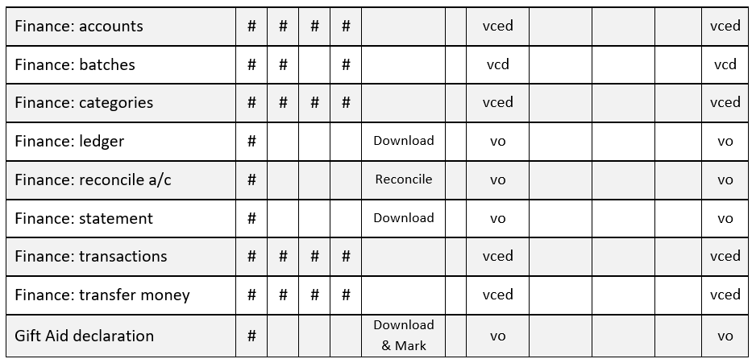The **Privileges** associated
with these Roles are as shown below.

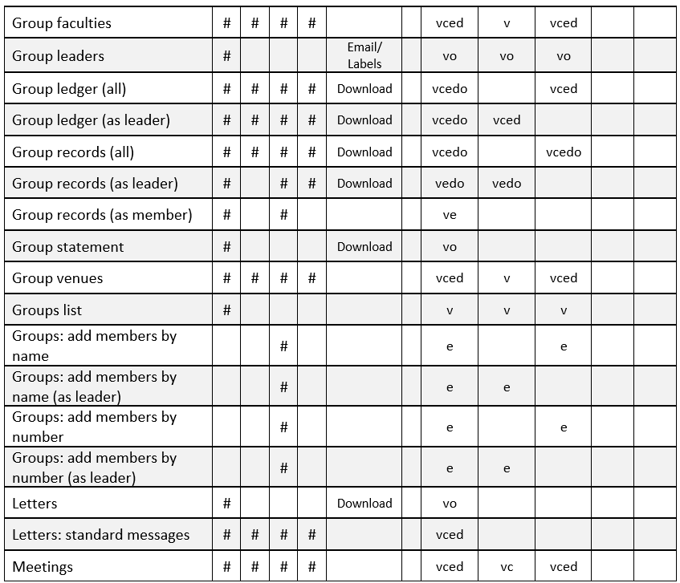

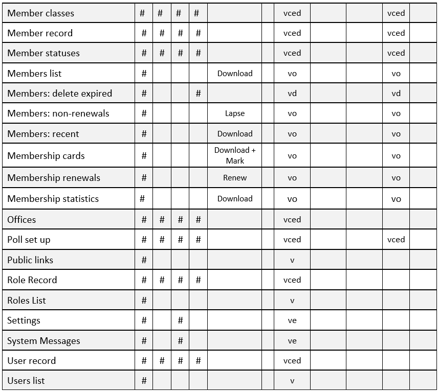

If you wish to change the default Roles or add new Roles, please [<u>see
8.2</u>](https://u3abeacon.zendesk.com/hc/en-gb/articles/360007304437-8-2-Roles-and-Privileges).

**Revision** **History**

||
||
||
||
||
||
||
||
||
||
||
||
