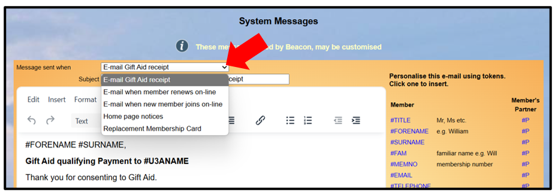

**8.5** **System** **Messages**

> Back

System Messages are sent to members automatically when certain events
occur.

Select **System** **messages** on the Home Page and click in the
drop-down box to see the following system messages:

Email when a member has consented to Gift Aid and a payment has been
made

Email when a member renews online

Email when a new member joins online

Email when a member orders a replacement membership card through the
Members Portal

Home page notices that are displayed at the bottom of the Beacon Home
Page and may be used to communicate to users when they log in.

The System Messages are set up on Site creation and may be customised to
suit individual u3a's.

Select the System Message from the drop-down list, make your amendments
and press the **Update** button.

The **Tokens** (on the right side) and the **Public** **Links** (at the
bottom of the page) may be included in the messages. See [<u>6.1.1
Sending
Emails</u>](https://u3abeacon.zendesk.com/hc/en-gb/articles/360007380438)
for additional information about composing emails.

*An* *update* *to* *the* *Insert* *menu* *from* *December* *2024* *was*
*the* *option* *to* *add* *Images,* *Emojis* *and* *Tables*

**Revision** **History**

||
||
||
||
||

||
||
||
