**8.6** **Finance** **Set-up**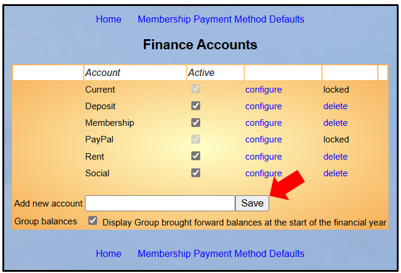

> Back

This article covers the managing of **Finance** **Accounts** and
**Finance** **Categories**. These areas of Beacon are generally only
available to the **Site** **Administrator** and **Treasurer**. The
Treasurer is key to how these are set up so they need to be involved at
the outset and have rights to these areas of the system and guide how
they are set.

1\. Finance Accounts

Click **Finance** **accounts** on the Home Page to view, create or edit
Accounts. Each Finance Account should correspond to a financial bank
account. Beacon finance is set by each u3a to suit their way of working
so there are many variations.

Some set up a Beacon Account for each or some of the following a bank
account, PayPal account, Cash, un-banked or promised membership fees
etc.. Each Finance Account can then be reconciled.

*Note:* *Some* *u3a's* *have* *found* *it* *helpful* *to* *create* *an*
*additional* *account* *called* ***Membership*** *which* *is* *used*
*to* *store* *unbanked* *membership* *payments* *before* *they* *are*
*transferred* *to* *the* *current* *or* *deposit* *account.* *Beacon*
*sites* *created* *since* *2020* *will* *have* *been* *initially*
*setup* *this* *way.*

*Of* *course* *it* *is* *down* *to* *each* *individual* *u3a* *to*
*decide* *what* *works* *best* *for* *them.*

A tick box at the bottom of the page enables the creation of **Group**
**Brought** **Forward** (B/F) transactions for all Groups that have
Transactions associated with them in the previous Financial Year
[(*<u>see
7.10.6.</u>)*](https://u3abeacon.zendesk.com/hc/en-gb/articles/19232714658461)

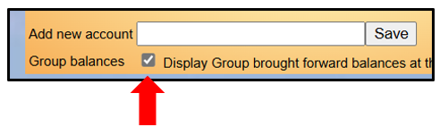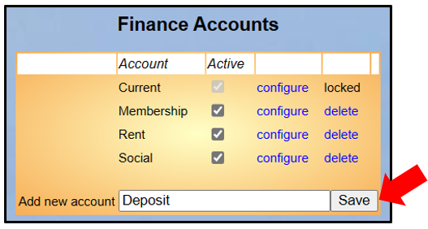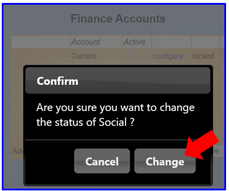

a\) Adding a new Account

Enter the Account name in the **Add** **new** **account** box and press
the **Save** button.

b\) Changing an Account Status and Name

Tick or untick the **Active** checkbox for an Account and confirm the
change according to whether or not the Account is currently being used.
Inactive Accounts do not appear in the current ledger.

*Note:* *Some* *accounts* *are* *locked.* *You* *are* *not* *allowed*
*to* *change* *these.*

Click **configure** next to the Account name to change the name, if
required.

**c)** **Setting** **Account** **Defaults**

When viewing the list of Accounts an option at the top and bottom of the
screen opens a new screen: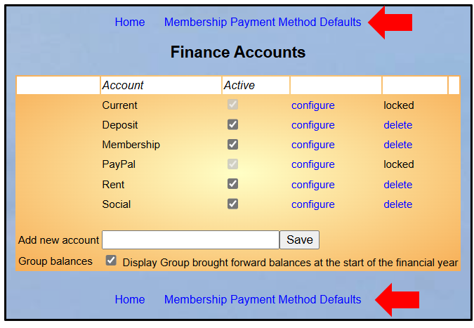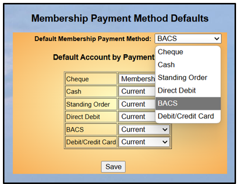

Using this you can set the default destination overall and also for each
type of payment:

**d)** **Pending** **Transactions**

Each Account may be configured with the option to show Transactions as
**Pending**:

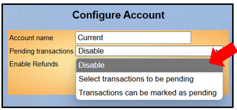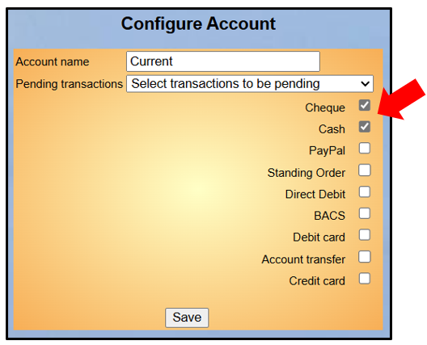

When **Disable** is selected, there is no Pending tick box on
Transaction Records.

When **Transactions** **can** **be** **marked** **as** **Pending** is
selected, the 'Pending' tick box is initially unchecked when adding a
Transaction Record, but can be checked to make the Transaction Pending.

When **Select** **Transactions** **to** **be** **Pending** is selected,
the form opens up tick boxes for each type of Transaction.

When one of the checked Transaction types is selected in a Transaction
Record, the 'Pending' tick box is initially checked, but can be
unchecked to make the Transaction not Pending.

Press the **Save** button to commit the Account Configuration changes.

You should discuss which options are required for each Account with your
Treasurer. For more information refer to [<u>7.10.5. Pending
Transactions</u>](https://u3abeacon.zendesk.com/hc/en-gb/articles/18029892590365).

**e)** **Refunds**

Each Account may be
configured with the option to enable Refunds so that they don't show as
income/expenditure in the Financial Statement. It also avoids the need
to create separate refund Transactions.

For more information refer to [<u>7.10.7.
Refunds</u>](https://u3abeacon.zendesk.com/hc/en-gb/articles/21268054883613).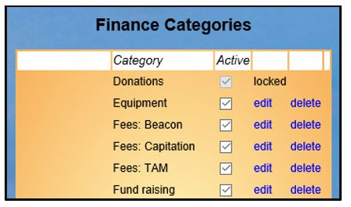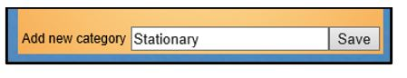

f\) Creating an Opening Balance

When using an Account for the first time it is likely that a starting
balance will need to be set up e.g. a bank balance. Do this by adding a
transaction as described in [7.2 Transaction
Record.](https://u3abeacon.zendesk.com/hc/en-gb/articles/360007367978)

Note that if you intend to use Beacon to produce a [7.6 Financial
Statement](https://u3abeacon.zendesk.com/hc/en-gb/articles/360007304357)
then the starting balance will need to be dated in the previous
financial year and the balance brought forward. This will stop the
balance appearing in the statement as income.

g\) Removing an Account

Click **delete** next to the Account name. You will not be allowed to
delete an Account if there are Transactions recorded against it **in**
**any** **year**. In which case, consider making it non-Active instead.

2\. Finance Categories

All Financial Transactions are assigned to one or more **Finance**
**Categories** in order to group together similar expenditure and income
for analysis and reporting.

Click **Finance** **categories** on the Home page to view, create or
edit categories.

Adding a Finance Category

Enter the category name in the **Add** **new** **category** box and
press the **Save** button.

Changing a Finance Category

Click **edit** next to the category name and change the name, if
required.

Tick or untick the **Active** checkbox for the Category according to
whether or not the Category is currently being used. Inactive categories
do not appear in new transactions.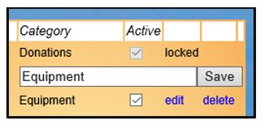

Press the **Save** button to commit the changes.

*Note:* *Some* *categories* *are* *locked.* *You* *are* *not* *allowed*
*to* *change* *these.*

Removing a Finance Category

Click **delete** next to the category name. You will not be allowed to
delete a category if there are transactions recorded against it **in**
**any** **year**. In which case, consider making it non-active instead.

*Note:* *Some* *categories* *are* *locked.* *You* *are* *not* *allowed*
*to* *delete* *these.*

**Revision** **History**

||
||
||
||
||
||
||
||
||
||
||

||
||
||
||
