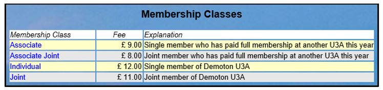
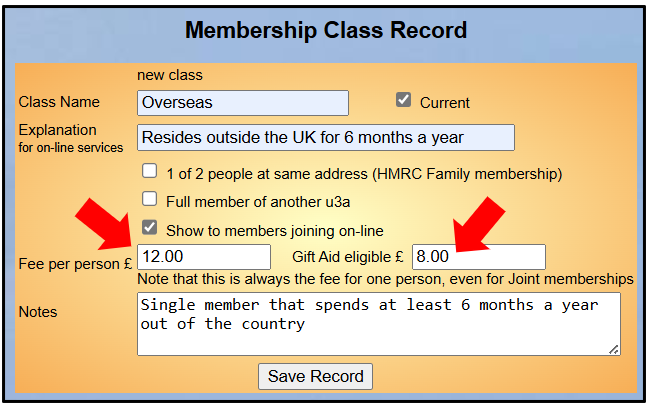
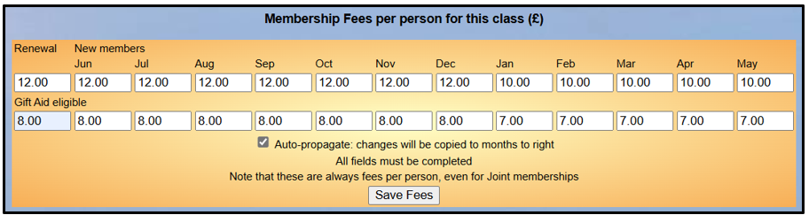
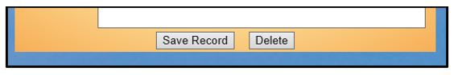
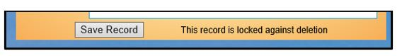
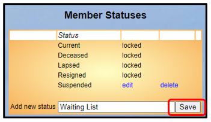
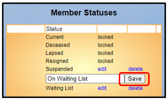
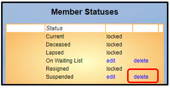
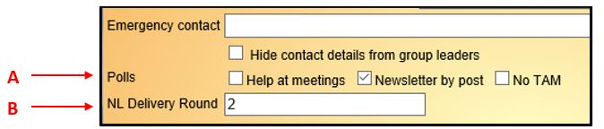

**8.7** **Membership** **Set-up**

> Back

**Please** **note** **that** **the** **additional** **line** **in**
**setting** **records** **for** **Gift** **Aid** **eligible** **has**
**not** **yet** **been** **implemented** **in** **the** **software.**

The parts of Beacon described below are generally only available to the
**Site** **Administrator**, although the necessary Privileges may be
assigned to other **Roles**.

[<u>Refer to
8.9</u>](https://u3abeacon.zendesk.com/hc/en-gb/articles/360007645557-8-9-Considerations-when-changing-fees-and-membership-years)
for considerations when changing fees and membership years.

a\) Membership Classes

Membership classes are the means of determining the fee to be paid for
membership.

Select **Membership** **classes** from the Home Page:

Click on a Membership Class to edit the Class Record and Membership
Fees, as described below.

Creating a new Membership Class

Click **Add** **New** **Membership** **Class** from the list of classes
or an existing Class Record:

Ticking **Current** indicates that the class may be used for new
memberships.

The **Explanation** text will display when a new member joins online (if
you have that facility enabled). Therefore, the explanation should be
clear and concise.

For each class you should consider whether to tick one or more of the
following options which will determine how Beacon processes memberships:

1 of 2 people at same address (meeting the HMRC requirements of Family
membership, [<u>see
7.8</u>](https://u3abeacon.zendesk.com/hc/en-gb/articles/360007304397-7-8-Gift-Aid))

Full member of another u3a (i.e. an Associate)

Show to members joining online

If your u3a’s fees are **rolling** or **same** **fees** **all** **year**
according to the **Membership** **Fees** option selected under
**System** **settings** ([<u>see
8.3</u>](https://u3abeacon.zendesk.com/hc/en-gb/articles/360007304457-8-3-System-Settings)),
there will be 1 or 2 'fee' fields on the form:

**Fee** **per** **person** is the annual fee <u>per person</u> (even for
a Joint membership)

If your u3a has Gift Aid enabled, the **Gift** **Aid** **eligible**
field enables the setting of a fee structure where the total fee does
not qualify for Gift Aid. The Gift Aid eligible amount must either be
the same or less than the Fee per person

If your fees **vary** **by** **month** **of** **joining**, see below.

Press the **Save** **Record** button to create the new Class Record.

*Note:* *if* *your* *u3a* *uses* *Beacon* *to* *produce* *Membership*
*Cards* [*(<u>see
4.7</u>)*](https://u3abeacon.zendesk.com/hc/en-gb/articles/360007304497)
*there* *can* *be* *a* *difficulty* *with* *the* *bar* *code* *and*
*the* *membership* *class* *overlapping,* *particularly* *if* *the*
*membership* *number* *was* *4* *digits* *and* *the* *class* *name* *is*
*long.* *This* *can* *be* *alleviated* *by* *using* *a* *shorter*
*class* *name.*

Assigning Varying Membership Fees

If your fees can **vary** **by** **month** **of** **joining**, a panel
is shown below the main Class Record with fields for each month of the
year (starting with the configured membership start month) plus another
for Renewals.

If your u3a has Gift Aid enabled, there will be 2 fields for each month;
one for the total fee and one for the Gift Aid eligible portion.

You must complete all fields before pressing the **Save** **Fees**
button to commit.

If you enter the fees from left to right and **Auto-propagate** is
ticked, then the fee you enter will be copied automatically to
succeeding months. In this way you will only need to alter the fee in
the month(s) when it changes.

Editing Membership Class Records

After making any changes to a Class Record, press the **Save**
**Record** button.

To remove a Class Record, press the **Delete** button.

*Note:* *some* *Classes* *(e.g.* *Individual)* *are* *locked* *against*
*deletion.*

You will not be able to delete a Class if there are members assigned to
it. Consider making it non-current instead.

b\) Member Statuses

The following Member Statuses will have been set up when your Site was
created. They are locked and cannot be edited or deleted:

Current Lapsed Resigned Deceased

*Note:* *at* *one* *time* *it* *was* *possible* *to* *edit* *the*
*Resigned* *and* *Deceased* *statuses.* *If* *this* *was* *done* *at*
*your* *u3a* *you* *must* *rename* *them* *back* *to* *Resigned* *and*
*Deceased.* *This* *is* *to* *ensure* *that* *Group* *Leaders* *cannot*
*inadvertently* *send* *emails* *to* *such* *members.*

To add a new status, enter the status name in the **Add** **new**
**status** box and press the **Save** button

To change a status name,
click **edit** next to the status name. Alter the name and press the
adjacent **Save** button to commit the change.

To remove a status, click **delete** next to the status
name.

c\) Polls & Custom Fields

**Polls** are a way of grouping members by some particular
characteristic that may be used when filtering lists of members. Members
may be assigned to one or more polls by ticking the poll boxes in the
**Member** **Record** **\[A\]** or by selecting **Add** **to** **poll**
in the **Members** **list**.

Up to 4 **Custom** **Fields** can be included on the Member Record
**\[B\]**.

Polls

If possible, it is recommended that you think about setting up your
Polls before your site is migrated onto Beacon so that the Polls and
Poll Assignments can be bulk loaded for you. Your Beacon Supporter can
advise about how to do this.

[<u>See
8.8</u>](https://u3abeacon.zendesk.com/hc/en-gb/articles/360007479358-8-8-Polls)
for more information about polls.

Custom Fields

Custom fields are non-functional and can be set-up by the Migration Team
during migration. You will have been advised to consider their use
before migration, but you can still request that they can be set up
post-migration by [<u>opening a Support
Ticket</u>.](https://u3abeacon.zendesk.com/hc/en-gb/articles/360007478557-Open-a-Support-Ticket)

Typical uses for Custom Fields include:

One u3a uses 2 custom fields, one for **Leaving** **Date** and the other
for the **reason**.

Another u3a uses two custom fields, one to indicate the delivery round
for **hand** **posting** of the newsletter and the second to indicate
the people who **deliver** the Newsletters to those rounds.

**Revision** **History**

||
||
||
||

||
||
||
||
