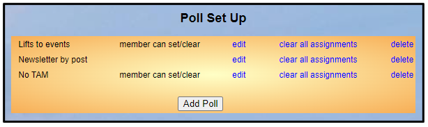
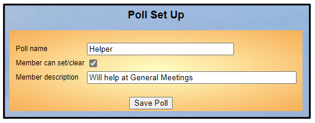

**8.8** **Polls**

> Back

Polls are a way of grouping members by some particular characteristic
that may be used when filtering The Membership List ([<u>see
4.1</u>](https://u3abeacon.zendesk.com/hc/en-gb/articles/360007301057-4-1-The-Membership-List)).

Typical uses for a poll include:

Members who don’t wish to receive the Third Age Matters magazine (TAM)
Members who receive paper copies of newsletters or AGM documents Members
willing to assist at meetings and events

Committee members (but see also [<u>9.3 u3a
Officers</u>)](https://u3abeacon.zendesk.com/hc/en-gb/articles/360007368118)

Members may be assigned to one or more polls by ticking the poll boxes
in the Member Record or by selecting **Add** **to** **poll** in the
Members list.

There is also an option to allow members to add/remove themselves
to/from polls through the Members Portal
([<u>see</u>](https://u3abeacon.zendesk.com/hc/en-gb/articles/360007368138)
[<u>10.2</u>)](https://u3abeacon.zendesk.com/hc/en-gb/articles/360007368138).

**View** **Polls**

Click **Poll** on the Home Page to display a list of polls.

**Add** **a** **poll**

To add a new poll, press **Add** **Poll**. Enter a name, a description
and tick the box if you wish to let members add/remove themself from the
poll, before pressing **Save** **Poll**.

The description cannot be empty if the box is ticked.

**Editing** **and** **Deleting** **a** **Poll**

Click the blue links in the Poll Set Up screen:

**edit** to change a poll name or description or to change the
**Member** **can** **set/clear** tick box **delete** to remove the poll

**clear** **all** **assignments** to remove all members from the poll

**Revision** **History**

||
||
||
||
