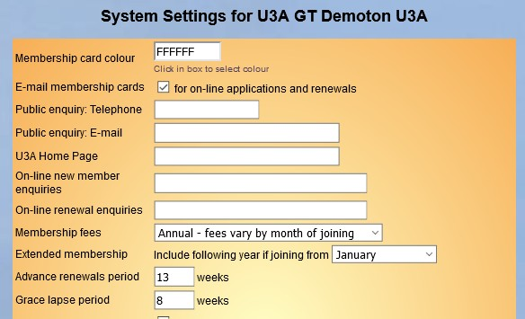
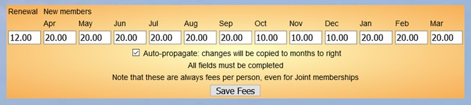

**8.9** **Considerations** **when** **changing** **fees** **and**
**membership** **years**

> Back

**Background**

u3a’s usual activities were on hold for a prolonged period of time
during 2020-2022. Committees considered whether they could compensate
members financially in some way. Also some u3as find they have surplus
funds or would like to change their membership year e.g. to spread their
annual workload.

The implications for Beacon of changing fees or extending the membership
period to achieve this are explored here. The Beacon Team cannot advise
on non-Beacon aspects of this but these are some important points to be
aware of and look into: -

Check your constitution: this may define your fee structure and
membership year, which may limit your Committee’s ability to make
changes without formal consultation and approval by membership at an
AGM/EGM.

If considering a change to your membership year: this could impact your
AGM timing. Holding your AGM after your membership year starts but
before members are lapsed may not be easy to manage.

Third Age Trust fees are still payable: all the usual contributions your
u3a makes for Trust membership, Third Age Matters (TAM) and Beacon are
payable in full.

On TAM note that the Beacon generated submission to the publishers only
includes one copy where two members share an address.

Make sure you can afford it: help your Treasurer do a projection going
forward. If your fees don’t cover the ongoing costs of activities, such
as room hire and speaker fees, your u3a won’t experience significantly
reduced outgoings. Some u3as run a healthy surplus and may look to
reduce this to be more aligned with Charity guidelines for reserves.

Keep things as simple as possible: avoid mixing elements of different
approaches.

Don’t rush to a decision. By all means signal to the membership their
Committee is looking at the best way to compensate members, or if that’s
not the case then explain your position.

Approaches and Implications - Reduce fees for the next year

This will involve implementing a one-off reduced fee for current members
at the next renewal period. If the renewal month isn’t imminent the
Committee may have time to make plans and calculate a reduction. If
renewals have started there will need to be a delay until the next
membership year.

To do this in Beacon: -

In the months between closing renewals and before the next advance
renewal period, set the membership fees for your membership classes
(Individual, Joint etc.) to the reduced fee.

Decide whether new members should pay the reduced rate or the normal
fee.

If you decide that new members should pay the normal full rate don’t be
tempted to create new Membership Classes – this adds complexity to
everyday Beacon use. The amount they pay can be controlled by setting
joining fees by month as described below.

To set joining fees by month make sure they are enabled. Login as
**admin**. From the **Home** page go into **System** **Settings** (under
**Setup**) and make sure “Member fees” are set to “*Annual* *–* *fees*
*vary* *by* *month* *of* *joining*” as below. Remember to click the
“Update” button at the bottom.

Note that the Advance renewals period is set to 13 weeks (3 months) and
the membership year starts on 1st April in this example.

Now go into **Membership** **Classes** under **Setup**. Click on a
class, e.g. **Individual**, and you see this table at the bottom.

The reduced Renewal fee of £12.00 (rather than the usual £20.00) is
entered on the left. Next are the Joining fees for each month, starting
with the month of renewal (April).

Completing this table requires some thought. In the above example new
i.e. Joining members will pay the full fee for the first six months of
the membership year April to September inclusive. For the next three
months they pay half price £10.00. However, because the advance renewal
period is 13 weeks or 3 months, the fees for January to March are set to
the full rate as they cover membership for the following year.

Also note that when completing this table amounts will auto-fill
propagate from left to right, but can be over typed.

Finally, u3as in a financial position to waive fees for a whole year
could set Renewal fees to £0 and simply renew all current members in one
go at the start of the membership year.

**Approaches** **and** **Implications** **-** **Extend** **the**
**membership** **year**

This is especially attractive if your u3a is currently processing
renewals or has done so recently.

By extending one membership year by a number of months as a one-off,
while keeping the same fee, members will receive additional months of
membership at no cost to them.

The membership year is a setting that must be changed by the Help Desk.
This is because there are Beacon side effects that need to be managed.

Before requesting the change wait until the non-renewal months between
renewals from the previous year completing and the start if the advanced
renewals period for the following year. This may well mean extending the
next membership year rather than the current one. For example, if your
membership year starts 1st April and the advance period is 2 months and
the grace period 2 months, then avoid the change from February to May
inclusive.

When the membership month is put back the Help Desk, following
discussion, can optionally set the renewal date of all your members on
Beacon to a new date. Consider the case of putting the membership year
back from 1st April to 1st June. If the renewal date remains 1st April
for all member a side effect will be that during the period from April
until members renew, their names will appear in red when viewing Group
participants. Unfortunately, changing the Grace

lapse period has no effect on this.

Conversely setting the renewal date to the next 1st June for all members
will make it harder to identify when then membership of lapsed and other
non-Current members expired.

So there are three options: -

Leave the dates in the membership records and put up with the red. When
members eventually renew the renewal date will be correctly set as
usual.

Increasing the advance renewal period and encourage members to renew
early. Discuss with the Help Desk changing the renewal date of all your
members on Beacon.

Note that membership renewals will be listed as normal in the
**Membership** **renewals** page from the number of Advanced renewals
weeks before the start of the membership year start month. For example
this will be from 1st July if the advanced renewals period is 13 weeks
and the membership year start on 1st October.

**Approaches** **and** **Implications** **-** **Extend** **the**
**renewal** **grace** **period**

If the start of your membership year is approaching and no fees have
been banked, then consider delaying renewals. This has the advantage
that fees can be reviewed and set at a later time (perhaps after
consulting the membership) and the membership year does not need to be
changed. It involves: -

Firstly, notify the membership not to renew or make payments (bank
transfers especially) until advised. If operating the member’s portal
then disable the ability to renew on-line (menu **Public** **Links**
then under **Configure** **Members** **Portal**). Set the **Grace**
**lapse** **period** in Beacon to e.g. 26 weeks. This will allow
renewals through the Members Portal when it is enabled at a later time.
Note that otherwise this has no effect beyond being a reminder to Beacon
System Users.

Don’t lapse any members. Everyone will go red in the Groups listings,
but this manageable given that group activity will be low.

When you are in a position to set fees for the remainder of the year
follow the steps above in Reduce fees for the next year

**Approaches** **and** **Implications** **-** **Issue** **refunds**

This is covered for completeness but is not recommended. Also note that
Charity law states than fees (these count as donations) ***can***
***only*** ***be*** ***refunded*** ***in*** ***special***
***circumstances***.

Issuing a partial refund of fees to members has attractions from the
perspective of members – they get some money back sooner rather than
later. For the Treasurer it would be a major logistical project
involving the writing and posting cheques, setting up bank transfers and
reconciling the bank account as cheques are cashed over many weeks. It
will also be difficult to set a refund amount before there is confidence
that activities have been resumed.

From a Beacon perspective, a transaction would need to be manually
entered against every member to reflect the refunded amount. If a u3a
operates Gift Aid, then the refund will need to be recorded against
individual member’s Gift Aid status – something Beacon does not do
automatically.

> **Summary**

To compensate members financially: -

Issuing refunds is not a realistic option

If you are in your renewal season then consider reducing fees for the
next year or extending the membership year If your u3a will be
processing renewals soon then consider reducing fees for the next year
or extending the renewal grace period

If you are mid-year then consider all approaches.

**Revision** **History**

||
||
||
||
||
||
||
||
||
||
||
||
