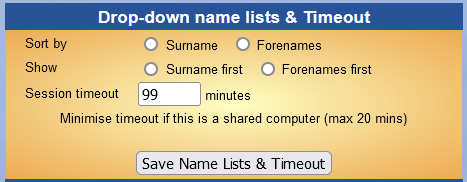
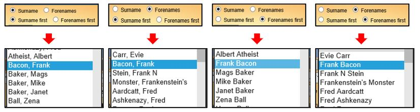
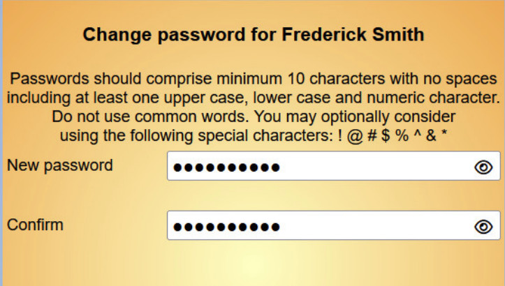

**9.1** **Personal** **Preferences**

> Back

Click **Personal** **preferences** on the Home Page to define how
certain parts of Beacon appear to you personally, as well as re-setting
your **Timeout** period, **Password** and **Security** **Question**.

The Personal Preferences page is split into 3 sections:-

a\) Drop-down Name Lists & Timeout

The preferences set here apply to the current computer or current user
only and settings are only stored if optional Cookies have been accepted
through the Cookie control.

Drop-down Lists

The appearance and order in which drop-down lists are displayed may be
changed to suit your personal preference. The options are to sort by
Surname or Forename and to display with Surnames first or Forenames
first.

Whichever combination is chosen, a name can be located quickly by typing
its first letter of the displayed name - the list then jumps to the
first name starting with that letter. For this reason, sorting and
displaying Surname first is probably the most useful.

Timeout

When Beacon has been inactive for a period of time, you are required to
log in again. This is an important security

precaution to reduce the likelihood of someone else using your computer
after you have logged in and then left the
machine.

By default, Beacon times out after 20 minutes and you should not make
the delay longer on a shared machine (it would be better to reduce it).
However, if you find this period inconvenient on a computer to which
no-one else has access, you may change the **Session** **timeout**
duration here. The maximum value is 99 minutes. Note that attempting to
set a larger value reverts the period to 20 minutes with no warning.

Press the **Save** **Name** **Lists** **&** **Timeout** button to save
your settings.

b\) Change Password

Note that if you have more than one Username (e.g. for admin and leading
a Group) each Username has its own independent password.

To change your password, enter your new password in the **New**
**password** box and enter it again in the **Confirm** box. As you type
there will be hints displayed to tell you whether you have chosen a good
password, if it meets the format requirements and if the 2 entries
match.

Press the **Change** **Password** button to bring the new password into
effect.

c\) Change Personal Q&A

To change your personal question and answer click in the **Question**
box. You can accept the default **Question** or change it to something
else. Make sure that the **Answer** is something that you will remember
(including the format) but which is unlikely to be known to anyone else.

> Note that like the password, if you have more than one Username they
> each have their own Q&A.

Press the **Update** **Q&A** button to store the new phrases.

**Revision** **History**

||
||
||
||
||
