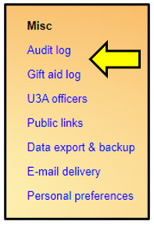
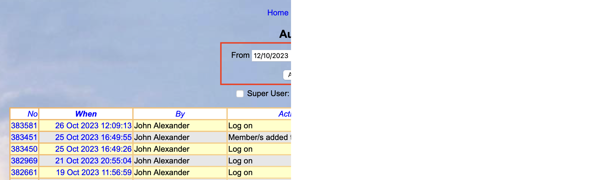
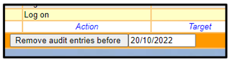
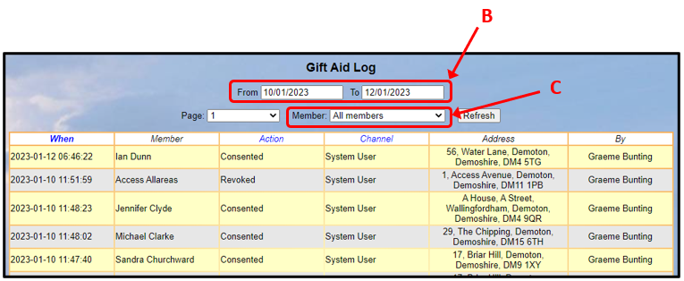

**9.2** **Audit** **Logs** **and**
**Searches**

> Back

Beacon has 2 audit reports under the **Misc** menu:

**a)** **Audit** **Log**

Click **Audit** **log** to view records of all actions by any user that
changed data and certain other actions too.

The period for which records are displayed may be changed by changing
the dates in the **From** and **To** fields and then pressing **Apply**
**Filter.** You now only be able to see a 3 month window but can select
another 3 months if necessary..

The format is technically-orientated to assist support personnel, but
users may find it useful to look at the audit log if something has not
gone as expected.

There is a button below the
table which may be used to remove audit entries before a specified date:

**b)** **Gift** **Aid** **Log**

The Gift Aid log keeps a record of when and by whom (member or System
User) Gift Aid consent was given or withdrawn.

The report is visible to System Users with the privilege "Gift Aid
declaration" (usually the Treasurer and Administrators) and is valid for
changes made from 10th January 2023 onwards.

The period for which records are displayed may be changed by changing
the dates in the **From** and **To** fields **\[B\]** or selecting a
page number in the Page drop-down list.

By default the report displays all members - individual members may be
viewed by selecting names in the Member drop-down list \[C\].

**Revision** **History**

||
||
||
||
