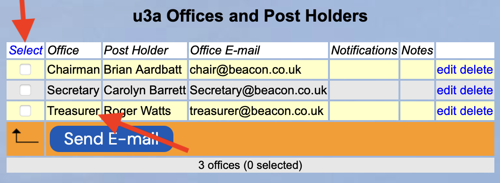
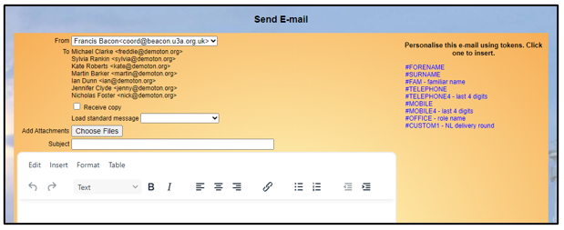
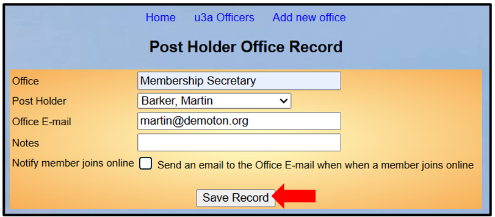
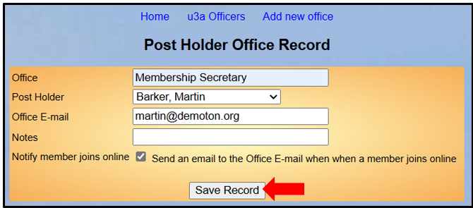
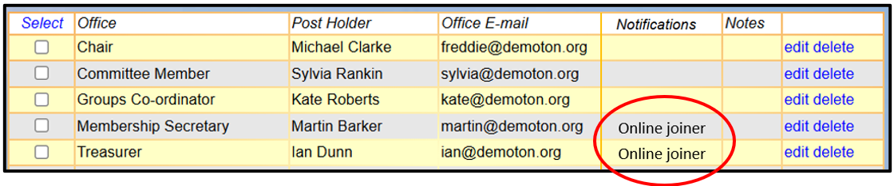
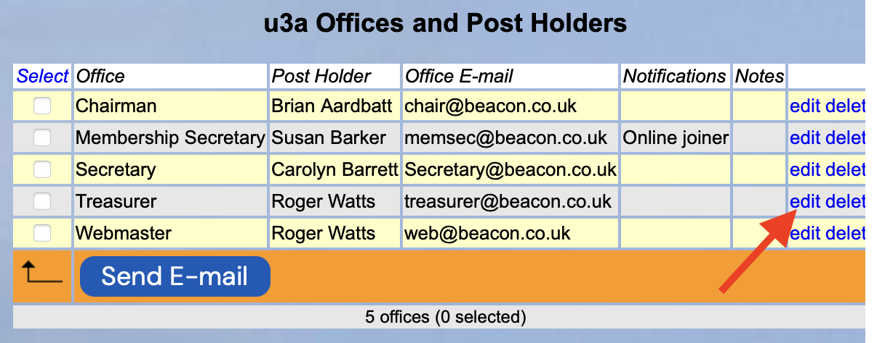
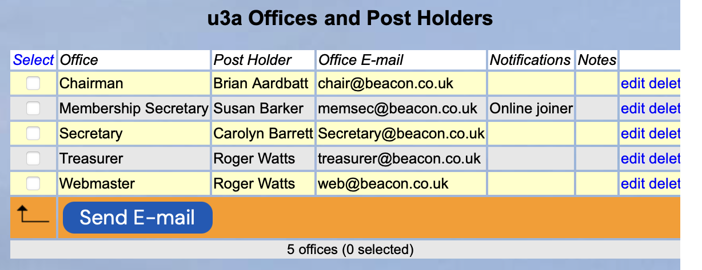
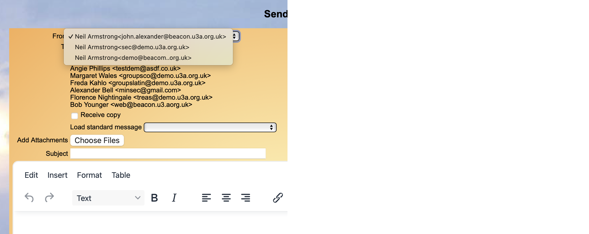
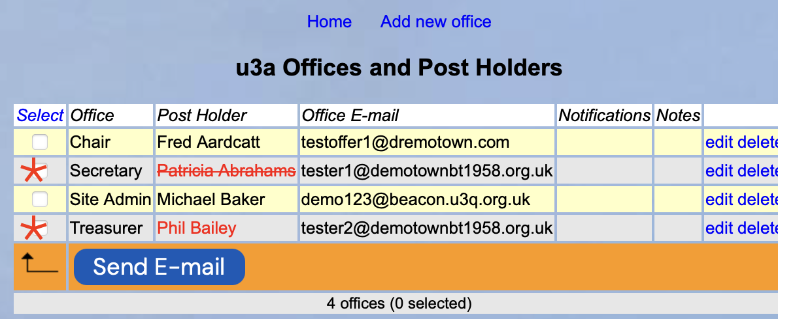

**9.3** **u3a** **Officers**

> Back

The **u3a** **Offices** **and** **Post** **Holders** page provides a
useful way for Beacon users to be able to send emails to some or all of
your u3a's post holders.

Sending an email to Post Holders

Click **u3a** **Officers** on the Home Page to open a list of the
Offices and Post Holders in your u3a.

Choose the people that you wish to send an email to using the tick boxes
in the **Select** column. Alternatively, click on the **Select** column
header to toggle all the checkboxes on or off.

Press **Send** **E-mail** to open up a form to compose the email:

Clicking the blue links on the right side of the browser will insert a
**Token** that can be used to personalise your email. For example,
**\#FORENAME** customises every email with the member’s Forename. There
is the list of the available Tokens below.

Please refer to [<u>section
6.1.1</u>](https://u3abeacon.zendesk.com/hc/en-gb/articles/360007380438)
for more information about sending emails.

**<u>List of Tokens</u>**

||
||
||
||
||
||
||
||
||
||
||

*Note:* *there* *are* *more* *Tokens* *available* *when* *sending*
*emails* *from* *other* *places* *such* *as* *the* *Members* *list* *or*
*Group* *Members* *list.*

Adding a new Office

Click **Add** **new** **office** at the top of the page and enter:

The name of the **Office**

The **Post** **Holder**, selected from the drop-down list of current
members

The associated **Office** **email** which may be the same as that stored
on the Member Record or it may be specific to the post, e.g.
[treasurer@…...](mailto:treasurer@%E2%80%A6..)

After filling out the form, press **Save** **Record**

There is a tick box on the form to enable the sending of a notification
to the officer when a new member joins online.

Officers that receive notifications are shown in the Notifications
column on the table; typically this would include the Membership
Secretary and Treasurer.

Changing an Office

To change an Office, click **edit** to the right of the office name.
Make the changes in the Post Holder Record form and press **Save**
**Record.** To delete an Office, click **delete** to the right of the
office name. You will be required to confirm deletion.

Choosing the email address to send from

When a person sends an email in Beacon it automatically puts in the
Member's personal email address for any responses.

If you set a person in the u3a Officers with an email attached to a
name, when that person logs into Beacon and sends an email they can then
choose from a dropdown the address for any replies. It can be their
personal one or any set against their name on u3a
Officers.

For example, when Roger Watts signs in, you can see above that he has 2
entries as **webmaster** and **Treasurer**

When he opens the Send Email
form, he will be able to select either of these office emails or his own
personal email to determine the "from" address and the destination for
any responses.

Identifying if a Post Holder is no longer
active

To make it easier to identify if a person is a Lapsed Member their name
is shown in Red (Phil Bailey above).

If a Member has been marked in the system as Deceased or Resigned then
their name is shown in Red and has line through it (as Patricia Abrahams
above).

**Revision** **History**

||
||
||
||
||
||
||
||
||
