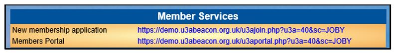
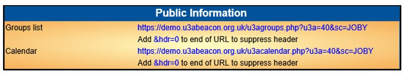
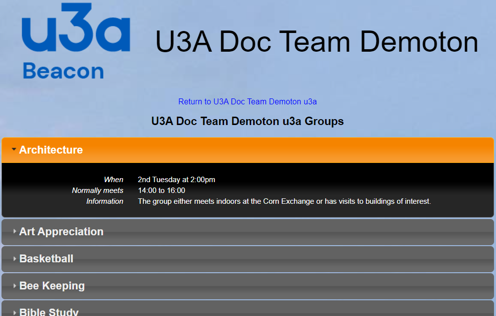
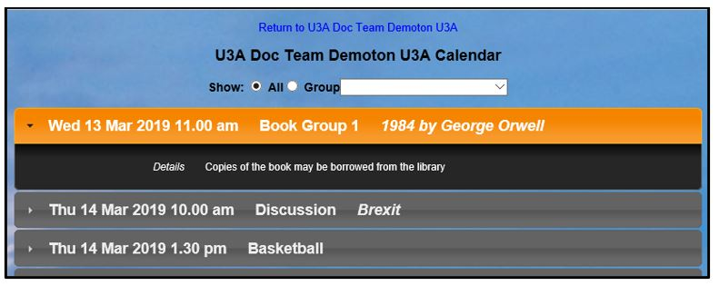
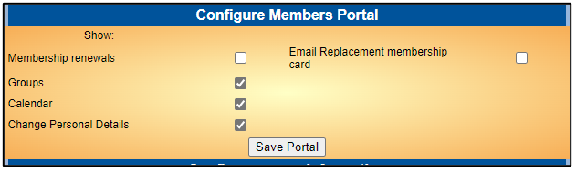
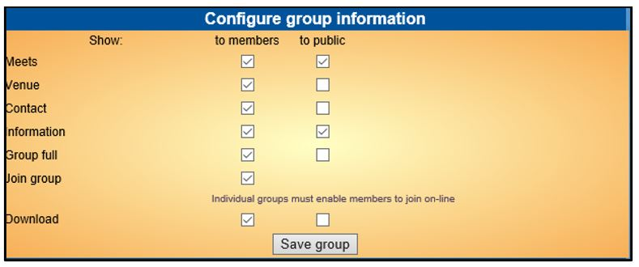
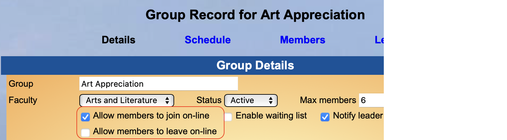
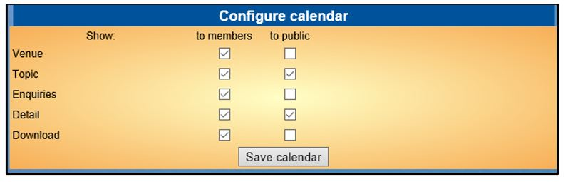

**9.4** **Public** **Links**

> Back

The parts of Beacon described below are generally only available to the
**Site** **Administrator**.

Click **Public** **links** on the Home Page to set the parameters for
your public links. These may be used in your U3A website to provide
access to services and information.

**N.B.** **The** **Trust** **states** **that** **a** **Privacy**
**Policy** **is** **essential** **and** **having** **one** **is**
**also** **part** **of** **the** **Beacon** **Terms** **and**
**Conditions.**

**It** **is** **important** **that** **both** **new** **people**
**joining** **your** **u3a** **and** **existing** **members**
**renewing** **are** **reminded** **of** **this** **and** **that**
**you** **will** **only** **use** **it** **in** **accordance** **with**
**this** **policy.**

The Public Links page is divided into 5 sections:-

a\) Member Services

These URL’s may be copied to
create links for online **Membership** **Applications** and logging in
to the **Members** **Portal**. When copying a URL, make sure that the
entire link is included.

b\) Public Information

These URL’s may be copied to
create links to the **Public** **Groups** list and the **Public**
**Calendar**. Adding **&hdr=0** suppresses the page header (U3A logo and
name) as shown in the Public Calendar picture below.

Public Groups

Public Calendar

c\) Configure Members Portal

The tick boxes control the options available to members when members
log-in to the **Members** **Portal**.

> An additional option introduced in September 2023 is to enable/disable
> members requesting a replacement membership card.

d\) Configure Group Information

The tick boxes control what
will be displayed in the versions of the **Groups** **List** available
to the Public and to Members (via the Members Portal).

Please note that if you want Members to be able to Join / Leave a Group
through the Members Portal then the Join Group box must be ticked. See
below for an illustration of options in a Group in the Red box. Each
Group needs to be set separately.

e\) Configure Calendar

The tick boxes control what will be displayed in the versions of the
**Groups** **List** available to the Public and to Members (via the
Members Portal).

**Revision** **History**

||
||
||
||
||
