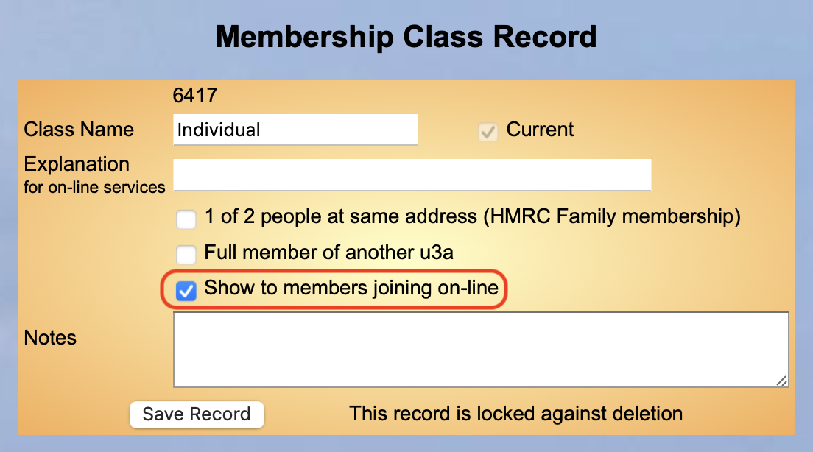
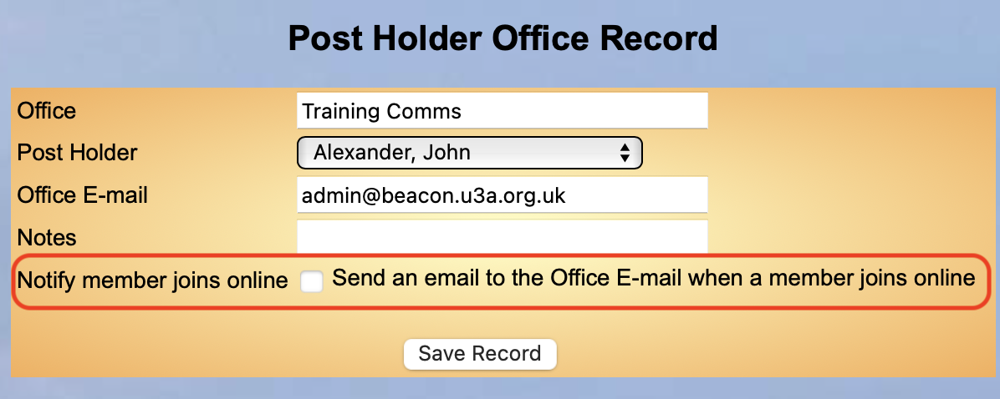
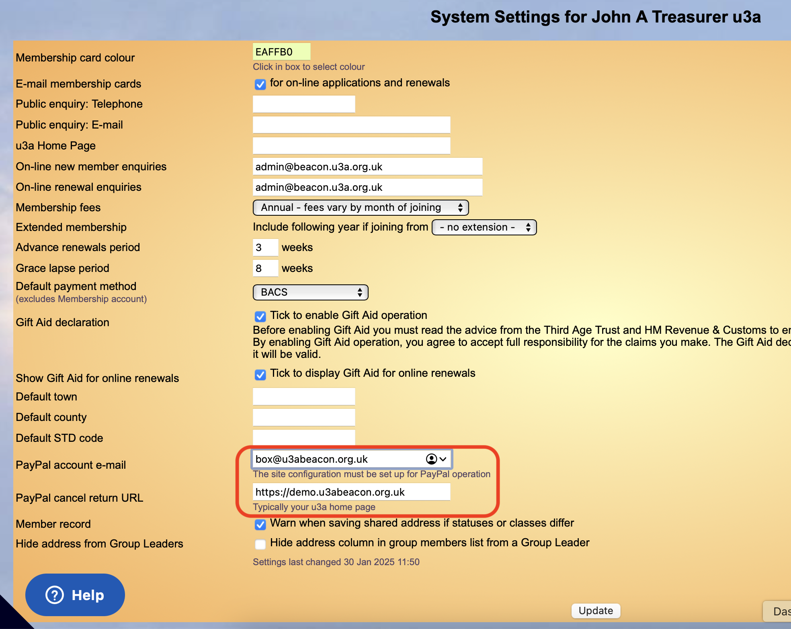
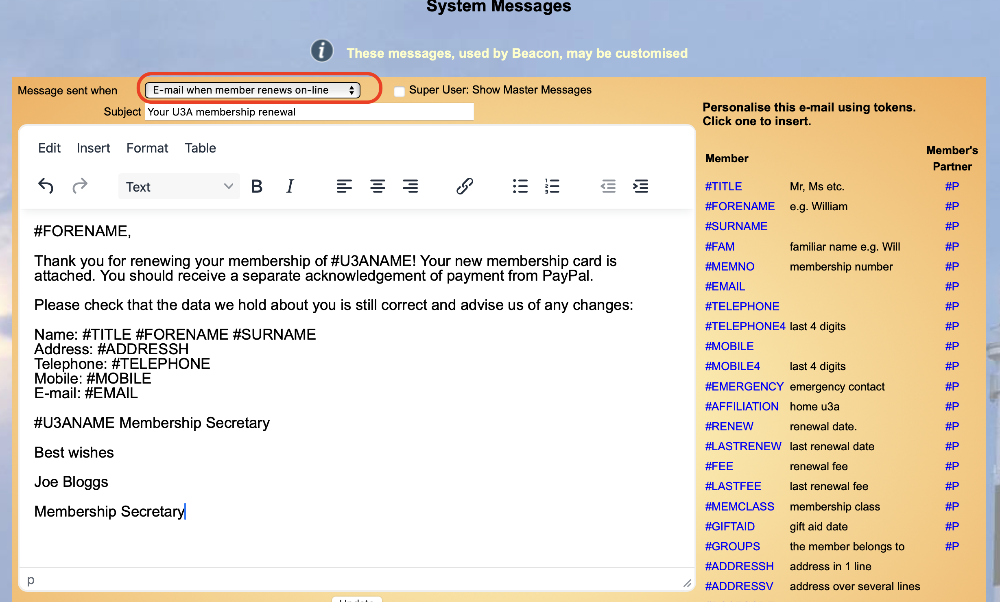

[u3a Beacon](https://u3abeacon.zendesk.com/hc/en-gb) \> [User
Guide](https://u3abeacon.zendesk.com/hc/en-gb/categories/360001240017-User-Guide)
\> [9. Miscellaneous
Options](https://u3abeacon.zendesk.com/hc/en-gb/sections/360002083057-9-Miscellaneous-Options)
Search

**Articles** **in** **this** **section**

**9.4.1** **Full** **description** **on** **setting** **up** **the**
**OnLine** **Joining** **/** **Renewal** **process**

>  style="width:0.41667in;height:0.41667in" />John Alexander Follow 5
> months ago · Updated

**This** **article** **goes** **through** **step-by-step** **the**
**process** **of** **setting** **up** **your** **Beacon** **system**
**for** **this** **facility.** **You** **do** **not** **need** **to**
**do** **these** **in** **the** **order** **shown** **but** **should**
**complete** **them** **all.**

**PayPal** **Account**

You will need to open a PayPal account in the name of your u3a. The
Treasurer or person who manages this account will need a role-based
email to do this as this is required by PayPal. If you are a registered
charity you get reduced commission charges so please make sure that you
open the correct type of account.
[<u>Set</u>](https://u3abeacon.zendesk.com/hc/en-gb/articles/9.8%20Setup%20On-line%20Transactions%20(PayPal))
[<u>up Pay Pal
account</u>](https://u3abeacon.zendesk.com/hc/en-gb/articles/9.8%20Setup%20On-line%20Transactions%20(PayPal))

**Site** **Settings**

You need to raise a Help Desk Ticket and ask them to change your Site
Settings to enable PayPal. You will also have to set a PayPal Account in
your Financial Ledgers and a PayPal commission in the Finance Category.
Here is a link to raise a ticket: [<u>Open a Support
Ticket</u>](https://u3abeacon.zendesk.com/hc/en-gb/articles/360007478557)

**Setting** **Membership** **Class** **to** **be** **available**

In the Membership Class you will need to set, for each class you want
new people to choose from, a tick in

the relevant box as shown in
red below. **Help**

**Joint** **members**, should you have joint members they can be renewed
by one member. You will need to check on who is paying if you claim Gift
Aid.

**Notifying** **key** **people** **of** **new** **members**

On the u3a Officers page if you click Edit against a person’s record you
will see this screen.

**Set** **up** **System** **Settings**

Your Site Admin will need to open up System Settings and put in the
email used for your Paypal account. This and the return URL are in the
red box in the screen image below. The return url is typically the web
address of your u3a. This is where a person goes when leaving the
joining screen.

**Confirmatory** **emails**

Your members will get an automatic email on Joining / Renewing.

The image below shows the demonstration one for members who renew. The
button on the red box can also include one for members joining.

Please create emails that suit your u3a and save them.

Please note that there is also an email for new people who join your
u3a. Both of these need to be set to your u3a's requirements. Please
keep the title for the Message sent remains as already exist.

**How** **your** **new** **members** **access** **the** **system**

On your u3a website you need a page for people who wish to join your
u3a.

We suggest that this page lists your membership rules and a statement
regarding Privacy Policy and how you handle the members data.

You then have a button to press on this page which is headed as
accepting your rules. This button then links members to the url listed
on the Public links page under New Membership application. There is an
article for this: [<u>10.1 Online
Joining</u>](https://u3abeacon.zendesk.com/hc/en-gb/articles/360007304577)

You might want to include in this email a link and instructions to your
new member on how to register to be able to access the members portal.

**Existing** **members** **renewing** **their** **membership**

Send an email to each member with a link to the Members Portal. In here
the individual can log in and carry out the renewal of their membership.

Existing members will need to register and then they can log into the
member’s portal to renew their membership, see this article: [<u>10.2.1
Online
Renewals</u>](https://u3abeacon.zendesk.com/hc/en-gb/articles/360007368158)

**Please** **see** **below** **for** **information** **about** **the**
**time** **period** **when** **a** **member** **can** **renew.**

**Finally**

We then suggest that you carry out a test transaction to verify that it
all works. To do this you will need to make sure that your test person
is due to renew and either current and not any other status. and that
they are in the Renewal Period set in your System Settings or in the
Grace Period.

To keep it simple set a membership class with a small fee, say £ 1.00.
Make sure that this class is ticked as being available to members
joining on line, then add a new member with this class. Once you're
happy that the process is working, delete this class of membership. You
can now ask your u3a to refund your testing fee.

**Now** **you** **can** **introduce** **this** **to** **your**
**membership.**

||
||
||
||

> Was this article helpful?
>
> Yes No
>
> 0 out of 0 found this helpful
>
> Have more questions? [<u>Submit a
> request</u>](https://u3abeacon.zendesk.com/hc/en-gb/requests/new)

Return to top

**Recently** **viewed** **articles** [9.4 Public
Links](https://u3abeacon.zendesk.com/hc/en-gb/articles/360007304537-9-4-Public-Links)

[9.3 u3a
Officers](https://u3abeacon.zendesk.com/hc/en-gb/articles/360007368118-9-3-u3a-Officers)

[9.2 Audit Logs and
Searches](https://u3abeacon.zendesk.com/hc/en-gb/articles/360007420777-9-2-Audit-Logs-and-Searches)

[9.1 Personal
Preferences](https://u3abeacon.zendesk.com/hc/en-gb/articles/360007368098-9-1-Personal-Preferences)

[8.9 Considerations when changing fees
and](https://u3abeacon.zendesk.com/hc/en-gb/articles/360007645557-8-9-Considerations-when-changing-fees-and-membership-years)
[membership
years](https://u3abeacon.zendesk.com/hc/en-gb/articles/360007645557-8-9-Considerations-when-changing-fees-and-membership-years)

**Related** **articles** [10.1 Online
Joining](https://u3abeacon.zendesk.com/hc/en-gb/related/click?data=BAh7CjobZGVzdGluYXRpb25fYXJ0aWNsZV9pZGwrCIGFG9JTADoYcmVmZXJyZXJfYXJ0aWNsZV9pZGwrCB1pq0pMFzoLbG9jYWxlSSIKZW4tZ2IGOgZFVDoIdXJsSSI4L2hjL2VuLWdiL2FydGljbGVzLzM2MDAwNzMwNDU3Ny0xMC0xLU9ubGluZS1Kb2luaW5nBjsIVDoJcmFua2kG--d19b6908e795c2569407a2b82aee91c16ec34df8)

[10.2.1 Online
Renewals](https://u3abeacon.zendesk.com/hc/en-gb/related/click?data=BAh7CjobZGVzdGluYXRpb25fYXJ0aWNsZV9pZGwrCN59HNJTADoYcmVmZXJyZXJfYXJ0aWNsZV9pZGwrCB1pq0pMFzoLbG9jYWxlSSIKZW4tZ2IGOgZFVDoIdXJsSSI7L2hjL2VuLWdiL2FydGljbGVzLzM2MDAwNzM2ODE1OC0xMC0yLTEtT25saW5lLVJlbmV3YWxzBjsIVDoJcmFua2kH--0a0185fba325d3dceb52bc20739505a178fdb844)

[9.8 Setup On-line Transactions
(PayPal)](https://u3abeacon.zendesk.com/hc/en-gb/related/click?data=BAh7CjobZGVzdGluYXRpb25fYXJ0aWNsZV9pZGwrCBb2V9JTADoYcmVmZXJyZXJfYXJ0aWNsZV9pZGwrCB1pq0pMFzoLbG9jYWxlSSIKZW4tZ2IGOgZFVDoIdXJsSSJKL2hjL2VuLWdiL2FydGljbGVzLzM2MDAxMTI2NTU1OC05LTgtU2V0dXAtT24tbGluZS1UcmFuc2FjdGlvbnMtUGF5UGFsBjsIVDoJcmFua2kI--80bb9d764a9f38058d0b48046ba309db885ae33e)

[Open a Support
Ticket](https://u3abeacon.zendesk.com/hc/en-gb/related/click?data=BAh7CjobZGVzdGluYXRpb25fYXJ0aWNsZV9pZGwrCB0tHtJTADoYcmVmZXJyZXJfYXJ0aWNsZV9pZGwrCB1pq0pMFzoLbG9jYWxlSSIKZW4tZ2IGOgZFVDoIdXJsSSI6L2hjL2VuLWdiL2FydGljbGVzLzM2MDAwNzQ3ODU1Ny1PcGVuLWEtU3VwcG9ydC1UaWNrZXQGOwhUOglyYW5raQk%3D--8bb681273cf45f62a14c6c5e9e42fe72ef1b77e4)

[Demo System Getting
Started](https://u3abeacon.zendesk.com/hc/en-gb/related/click?data=BAh7CjobZGVzdGluYXRpb25fYXJ0aWNsZV9pZGwrCEK4HtJTADoYcmVmZXJyZXJfYXJ0aWNsZV9pZGwrCB1pq0pMFzoLbG9jYWxlSSIKZW4tZ2IGOgZFVDoIdXJsSSJAL2hjL2VuLWdiL2FydGljbGVzLzM2MDAwNzUxNDE3OC1EZW1vLVN5c3RlbS1HZXR0aW5nLVN0YXJ0ZWQGOwhUOglyYW5raQo%3D--a64266c56e34330f671721cab1098a80cd37824a)

**Comments** 0 comments

Please [<u>sign
in</u>](https://u3abeacon.zendesk.com/access?locale=en-gb&brand_id=360000694158&return_to=https%3A%2F%2Fu3abeacon.zendesk.com%2Fhc%2Fen-gb%2Farticles%2F25616437700893-9-4-1-Full-description-on-setting-up-the-OnLine-Joining-Renewal-process)
to leave a comment.

[u3a Beacon](https://u3abeacon.zendesk.com/hc/en-gb)

> [<u>Powered by
> Zendesk</u>](https://www.zendesk.co.uk/service/help-center/?utm_source=helpcenter&utm_medium=poweredbyzendesk&utm_campaign=text&utm_content=u3a+Beacon+Support)
