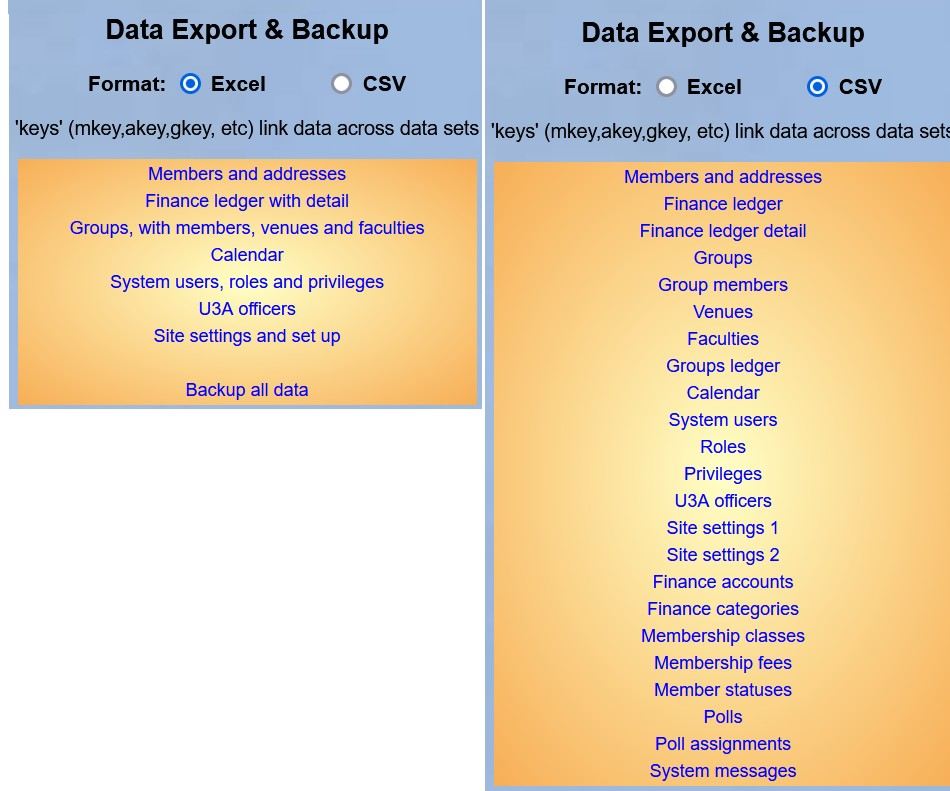

**9.5** **Data** **Export** **and**
**Backup**

> Back

For reasons of data protection, the parts of Beacon described below are
generally only available to the **Site** **Administrator** and key post
holders.

This facility is provided to allow u3as to download their data for use
in external applications, reporting tools, etc. and also so that they
can keep backups of their own data locally. A backup can also be used to
re-build something deleted in error such as a Group.

Backing Up

Select **Data** **export** **&** **backup** from the Home Page.

Data can be downloaded in either of two formats: **Excel** or **CSV**.

According to the format you select, a different list of downloads will
be displayed. You can download the same data in either format, but
whereas Excel can contain related data on different worksheets within
the same spreadsheet, CSV files can only contain one kind of data. There
are therefore more options when selecting CSV.

There is one additional option under Excel: **Backup** **all** **data**.
If this is selected, all the data that can be downloaded individually by
the other options will be downloaded as a single spreadsheet. This is
therefore the best option for backing up all data.

Depending on your browser, you will be given the choice of **Opening**
the download or **Saving** it in your default download (or other)
location. For **Opening** the default application on your computer for
.xlsx or .csv files should be invoked.

If you keep downloads with personal information then they should be
encrypted. This can be done with Excel (usually File \> Info \> Protect
Workbook) or with a tool such as the popular 7-zip.

Guidance on interpreting backups

The majority of the sheets, and their .csv equivalents, have columns
that are self-explanatory, or that can easily be deduced by referring to
your data on various Beacon screens.

For those with a value 1 or 0, e.g. sheet "Venues" columns "private" and
"accessible", then 1 means yes, true or applies and 0 or empty means no
or false.

The less obvious are columns mainly to aid with linking the data in
individual sheets reliably.

||
||
||
||
||

||
||
||
||
||
||
||
||
||
||
||
||
||
||
||
||
||
||

Important note

The whole Beacon database for all u3as is backed up nightly and stored
off site. However, there is no capability to restore an individual u3a's
data from either this backup or a "Backup all data" as descibed above.

Revision History

||
||
||
||
||
||
||

||
||
||
||
