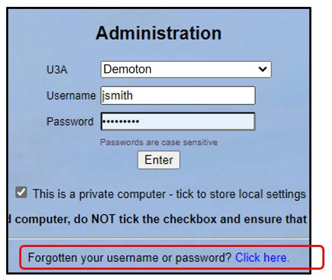
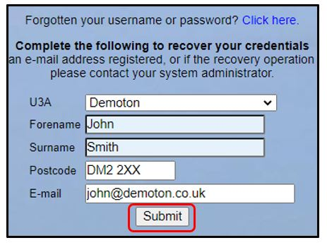

**9.6.** **Recovering** **a** **forgotten** **Username** **or**
**Password**

> Back

If you have forgotten your username or password, you may be able to
recover it. Use the **Click** **here** link on the login page

Complete the requested information and press **Submit**.

If you are able to be identified, you will then be asked the answer to
your personal question. Make sure that you type this in the same format
as when it was originally set.

If your answer is correct, you will be sent an email with your Username
and a new temporary password, which will need to be changed at first
login.

More than one Username

If you have more than one Username, because you have more than one role,
then Beacon will prompt with the personal question of the first role it
finds associated with your member record. The email you receive will
include both the Username and temporary password to use.

If the Username or password you have forgotten is for one of your other
roles then you will need to contact your Site Administrator to remind
you of your other Username(s) and if necessary send you a temporary
password.

*Note:* *you* *cannot* *recover* *a* *password* *for* *the* *Site*
*Administrator* *by* *this* *means.* *If* *you* *cannot* *log* *in* *as*
*a* *Site* *Administrator,* *you* *must* *raise* *a* *ticket* *with*
*the* [***<u>Ongoing Help
team</u>**.*](https://u3abeacon.zendesk.com/hc/en-gb/articles/360007478557-Open-a-Support-Ticket)

Revision History

||
||
||
||
