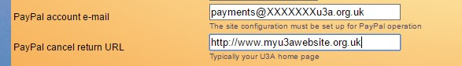
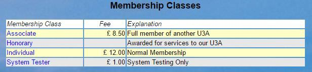
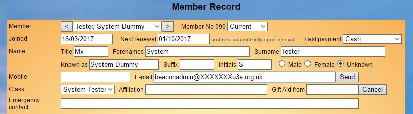
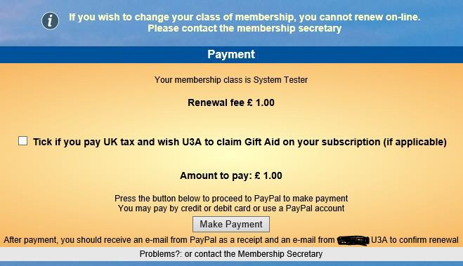

**9.8** **Setup** **On-line** **Transactions**
**(PayPal)**

> Back

Beacon can be setup for your u3a to allow Members to renew or join
on-line. They can pay their fees with a credit/debit card or a PayPal
account using PayPal’s Services.

The article is based on a document sent to u3as when they go live on
Beacon and describes the setup steps. The user experience is documented
in [**<u>Online
Joinin</u>g**](https://u3abeacon.zendesk.com/hc/en-gb/articles/360007304577)

How does it work?

A PayPal account is a merchant account (not the same as a bank account)
but Beacon’s financial module treats it similarly to other bank
accounts. On-line payment is accessed from a u3a’s website, either via
the Members Portal (for renewals) or a ‘Join Here’ (or similar link) for
new memberships.

When a payment is required, Beacon transfers the Member to the PayPal
website where the payment is made. When the transaction is complete,
PayPal advises Beacon directly so that it can register the payment as
having been made. PayPal also notifies both the Member (customer) and
the u3a (merchant) that the transaction has taken place. However, PayPal
does not pass any financial or bank details to Beacon, thus ensuring
financial security for the user.

PayPal charges u3as a commission for each transaction; there is no
standing charge. The commission comprises a fixed amount per transaction
plus a percentage of the transaction amount. Most u3as are charities so
are eligible for PayPal's charity tariff, which reduces commission by
more than half. Our current information is that the charity tariff is
20p plus 1.4% of the amount. **Please** **check** **the** **rates**
**when** **you** **want** **to** **start** **using** **PayPal** **as**
**they** **may** **vary.**

You can initiate direct transfers of money from PayPal to your u3a's
bank. This is done from your PayPal account control panel under the
Money menu. You should always withdraw at least £50 at a time to avoid a
withdrawal charge. It can take up to 7 days for money to be transferred
from your PayPal account to your u3a bank account.

What is required?

Preparing for On-line payment involves these steps:

> 1\. Set up a non-personal email address (i.e. a role based one such as
> treasurer@....) 2. Set up a PayPal account
>
> 3\. Register the account as a PayPal Charity account 4. Set up Beacon
> for On-line transactions
>
> 5\. Test that it works before going ‘live’.

Setting up a Paypal Account

A PayPal Business account should be set up together with a facility to
transfer money directly from PayPal to the u3a’s ordinary bank account.
Responsibility for setting up and operating a PayPal account rests
solely with the u3a. Setting up a PayPal Account should be quick and
simple. Unfortunately, it is neither.

Warning: Setting up a PayPal account is best done by the Treasurer after
consultation with the other u3a Trustees.

This is because a PayPal account can make payments (not through Beacon)
as well as receive fees. Normally a u3a bank account would require two
signatures for transactions to protect against unauthorised expenditure.
PayPal cannot do this so the u3a’s Trustees (Committee members) need to
be aware that the potential for unauthorised expenditure exists – and
that the u3a PayPal account won’t have a transaction limit. Were such an
occurrence to go undetected for any length of time, it would be very
difficult to undo. Fortunately, PayPal does provide means of accessing
the u3a transaction record and also emails out a monthly statement.
While it is recommended that this should go directly to a second
committee member, we believe that this is not currently available as
PayPal only communicates to a single email. A u3a should therefore be
aware of this and make sure that their Financial rules cover this and
ask that the PayPal contact share any documents with a second person.

Note: There are deep links into the PayPal website in the steps below.
The intention is to be helpful but they could become broken. Please
comment at the end of this article if you have any problems.

**Step** **1**. First you must create an email address that you want to
be associated with the account. It should be a non-personal address that
will not change when u3a officers change, e.g.
payments@XXXXXXXu3a.org.uk PayPal will always use this address to
communicate with you. It is sometimes called the Account Reference.

**Step** **2.** **Create** **a** **PayPal** **business** **account**
**here:**
[**<u>www.paypal.com/uk/webapps/mpp/not-for-profit-2</u>**](https://www.paypal.com/uk/webapps/mpp/not-for-profit-2)
Scroll down to "How to get started". Click on the "Find out what you
need here link" and select "Charity" (rather than Not-for-Profit). To
create a Business Account go back to the top and click on "Get a
Business Account" (you do this even though you are a charity).

The email address you enter at the next screen is the one you’ve
previously created. PayPal will test that the email you have provided is
genuine.

**Step** **3**. Confirm your Charity's PayPal account here
[**<u>www.paypal.com/uk/charities</u>**](https://www.paypal.com/uk/charities)

PayPal Hints and Tips

Configuring your PayPal account can be a time-consuming task: collecting
the necessary information, working out what to do and waiting for PayPal
to respond. The PayPal website can be a bit of a maze, with lots of
loops that bring you back to the same place; but persevere.

Whoever sets up the account (Treasurer advised) needs to provide a lot
of details about who you are, your organisation, u3a banking details and
an email address dedicated to receiving money (Step 1 above).

PayPal does a test transaction by crediting £0.01 to your account. When
you’ve acknowledged that, you are given a basic trading account with a
transaction limit. You have to upload more credentials to PayPal in
order to unlock that limit – some Users have had difficulty with this
bit of their website and a response may take some weeks.

To get the charity rate you must prove that you are a charity. This is
described in PayPal's PDF document [**<u>PayPal Guide
to</u>**](https://www.paypalobjects.com/digitalassets/c/EMEA/messaging_documents/453776_PayPal_Charity_Guide_to_enrolling.pdf)
[**<u>charity
enrolling</u>**](https://www.paypalobjects.com/digitalassets/c/EMEA/messaging_documents/453776_PayPal_Charity_Guide_to_enrolling.pdf)
Your experience may differ, and some u3a’s claim to have managed this
step more easily by phone or perhaps Online Chat with Paypal.

Note that if your charity isn't registered with the Charities Commission
or HMRC you are likely to need to supply details of all your u3a's
Officers.

Beacon Setup

**Step** **4**. Beacon only
requires the account reference, i.e. the PayPal Account email, to allow
a member to make a payment to PayPal; no password is required. Beacon
cannot access the account details or withdraw money. You must NEVER pass
any account details except the account reference (email) to anyone
involved in the support of Beacon or the Third Age Trust. In **System**
**Settings**, enter your PayPal account and a PayPal cancel return
address.

PayPal must also be enabled in your Beacon's (hidden) Site Record -
raise a [**<u>Support
ticket</u>**](https://u3abeacon.zendesk.com/hc/en-gb/articles/360007478557)
to do this.

**Step** **5**. Test that your new On-line payment system works
correctly before allowing u3a Members use it. This procedure checks the
Membership Renewal function to ensure that the setting up of both PayPal
and Beacon have been done successfully. It uses real money and costs
£1.00.

The first step is to set up a dummy Membership Class and a dummy Member.
Once these have been created, they can be used for testing all sorts of
Beacon functions. Call the dummy membership class ‘System Tester’ with a
membership fee of £1.00.

Then create a dummy Member such as 'Mx System Tester'. It will need your
real email address and physical address. Save the record.

Change the status to make sure that it is NOT ‘Lapsed’ and Next renewal
to yesterday’s date. Save the record. You are now ready to test.

Go to the u3a’s website and
Login to the Members Portal using Mx System Tester’s details. You are
then invited to renew membership.

Do NOT tick the Gift Aid box (Mx System Tester cannot pay UK Tax).

Click to make payment from your personal PayPal account, credit or debit
card. Now check the following: -

You should receive two confirmatory emails: one from PayPal (to
Customer) to your personal mailbox and one from Beacon.

There will be a further email from PayPal (to Merchant), the u3a PayPal
account

holder (Treasurer advised), and the fee of £1.00 minus PayPal Commission
should arrive in the u3a’s PayPal Account.

Mx System Tester’s membership record has been updated showing that the
status is Current and Next Renewal Date has also changed.

If these have all happened, then the PayPal and Beacon setups have been
correctly configured and the system is ready for live On-line Payments.

Do not forget to change the Status of Mx System Tester back to ‘Lapsed’
to prevent the u3a’s Membership Statistics being skewed. Mx System
Tester can be used again and again for other purposes.

Finally, do not forget to claim your £1.00 back from the Treasurer.

**Revision** **History**

||
||
||
||
||
||
||
||
