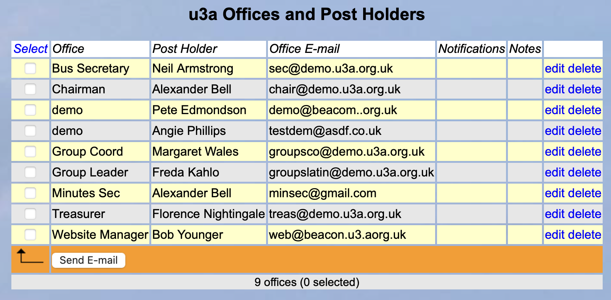
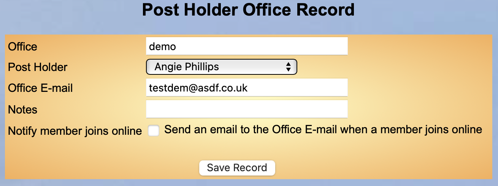
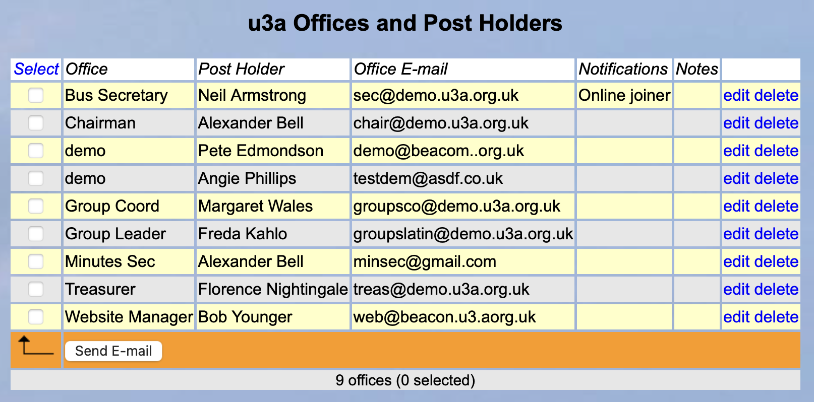

[u3a Beacon](https://u3abeacon.zendesk.com/hc/en-gb) \> [User
Guide](https://u3abeacon.zendesk.com/hc/en-gb/categories/360001240017-User-Guide)
\> [9. Miscellaneous
Options](https://u3abeacon.zendesk.com/hc/en-gb/sections/360002083057-9-Miscellaneous-Options)
Search

**Articles** **in** **this** **section**

**9.9** **Officers** **Notification** **of** **people** **Joining**
**Online**

>  style="width:0.41667in;height:0.41667in" />John Alexander Follow 1
> year ago · Updated

To aid officers to know when a person joins using the On Line Joining
facility you can now select individual u3a Officers to receive
notification.

To do this go to the u3a Officers screen and select edit in the line
with the individuals name.

Fig 1

You will now see the following screen:

>  style="width:1.125in;height:0.47892in" />**Help**

Fig 2

You can now select the tick box at the bottom to set this person to
receive an email of a new Member joining using the OnLine facility.

Fig 3

You can see in Fig 3 above the comment under Notifications.

Revision History

||
||
||
||

> Was this article helpful?
>
> Yes No
>
> 2 out of 2 found this helpful
>
> Have more questions? [<u>Submit a
> request</u>](https://u3abeacon.zendesk.com/hc/en-gb/requests/new)

Return to top

**Recently** **viewed** **articles**

[9.8 Setup On-line Transactions
(PayPal)](https://u3abeacon.zendesk.com/hc/en-gb/articles/360011265558-9-8-Setup-On-line-Transactions-PayPal)

[9.7. Temporary
Passwords](https://u3abeacon.zendesk.com/hc/en-gb/articles/360007479478-9-7-Temporary-Passwords)

[9.6. Recovering a forgotten Username or
Password](https://u3abeacon.zendesk.com/hc/en-gb/articles/360007420857-9-6-Recovering-a-forgotten-Username-or-Password)

[9.5.1 What to do with Beacon records
when](https://u3abeacon.zendesk.com/hc/en-gb/articles/4403130339601-9-5-1-What-to-do-with-Beacon-records-when-leaving-Beacon)
[leaving
Beacon](https://u3abeacon.zendesk.com/hc/en-gb/articles/4403130339601-9-5-1-What-to-do-with-Beacon-records-when-leaving-Beacon)

[9.5 Data Export and
Backup](https://u3abeacon.zendesk.com/hc/en-gb/articles/360007304557-9-5-Data-Export-and-Backup)

**Related** **articles** [9.3 u3a
Officers](https://u3abeacon.zendesk.com/hc/en-gb/related/click?data=BAh7CjobZGVzdGluYXRpb25fYXJ0aWNsZV9pZGwrCLZ9HNJTADoYcmVmZXJyZXJfYXJ0aWNsZV9pZGwrCB17B5pcFjoLbG9jYWxlSSIKZW4tZ2IGOgZFVDoIdXJsSSI1L2hjL2VuLWdiL2FydGljbGVzLzM2MDAwNzM2ODExOC05LTMtdTNhLU9mZmljZXJzBjsIVDoJcmFua2kG--c36ad6491d1aab3d2c320d5b4047ab1cfc824e81)

[10.2.1 Online
Renewals](https://u3abeacon.zendesk.com/hc/en-gb/related/click?data=BAh7CjobZGVzdGluYXRpb25fYXJ0aWNsZV9pZGwrCN59HNJTADoYcmVmZXJyZXJfYXJ0aWNsZV9pZGwrCB17B5pcFjoLbG9jYWxlSSIKZW4tZ2IGOgZFVDoIdXJsSSI7L2hjL2VuLWdiL2FydGljbGVzLzM2MDAwNzM2ODE1OC0xMC0yLTEtT25saW5lLVJlbmV3YWxzBjsIVDoJcmFua2kH--a4484080210a27553e6ba5c372e47e9209a3bb39)

[7.9.1 Setting up Online Membership
Payments](https://u3abeacon.zendesk.com/hc/en-gb/related/click?data=BAh7CjobZGVzdGluYXRpb25fYXJ0aWNsZV9pZGwrCIlxHdJTADoYcmVmZXJyZXJfYXJ0aWNsZV9pZGwrCB17B5pcFjoLbG9jYWxlSSIKZW4tZ2IGOgZFVDoIdXJsSSJQL2hjL2VuLWdiL2FydGljbGVzLzM2MDAwNzQzMDUzNy03LTktMS1TZXR0aW5nLXVwLU9ubGluZS1NZW1iZXJzaGlwLVBheW1lbnRzBjsIVDoJcmFua2kI--330a978d8851ff298ac3829b273f49e7c9ab52d0)

[9.8 Setup On-line Transactions
(PayPal)](https://u3abeacon.zendesk.com/hc/en-gb/related/click?data=BAh7CjobZGVzdGluYXRpb25fYXJ0aWNsZV9pZGwrCBb2V9JTADoYcmVmZXJyZXJfYXJ0aWNsZV9pZGwrCB17B5pcFjoLbG9jYWxlSSIKZW4tZ2IGOgZFVDoIdXJsSSJKL2hjL2VuLWdiL2FydGljbGVzLzM2MDAxMTI2NTU1OC05LTgtU2V0dXAtT24tbGluZS1UcmFuc2FjdGlvbnMtUGF5UGFsBjsIVDoJcmFua2kJ--f5312ae17dc7fce5443285382b33bcebc16b94f4)

[9.2 Audit Logs and
Searches](https://u3abeacon.zendesk.com/hc/en-gb/related/click?data=BAh7CjobZGVzdGluYXRpb25fYXJ0aWNsZV9pZGwrCGlLHdJTADoYcmVmZXJyZXJfYXJ0aWNsZV9pZGwrCB17B5pcFjoLbG9jYWxlSSIKZW4tZ2IGOgZFVDoIdXJsSSJAL2hjL2VuLWdiL2FydGljbGVzLzM2MDAwNzQyMDc3Ny05LTItQXVkaXQtTG9ncy1hbmQtU2VhcmNoZXMGOwhUOglyYW5raQo%3D--37686e703ce9a61e4b383be6016f9cc844796b2f)

**Comments** 0 comments

Please [<u>sign
in</u>](https://u3abeacon.zendesk.com/access?locale=en-gb&brand_id=360000694158&return_to=https%3A%2F%2Fu3abeacon.zendesk.com%2Fhc%2Fen-gb%2Farticles%2F24586976983837-9-9-Officers-Notification-of-people-Joining-Online)
to leave a comment.

[u3a Beacon](https://u3abeacon.zendesk.com/hc/en-gb)

> [<u>Powered by
> Zendesk</u>](https://www.zendesk.co.uk/service/help-center/?utm_source=helpcenter&utm_medium=poweredbyzendesk&utm_campaign=text&utm_content=u3a+Beacon+Support)
